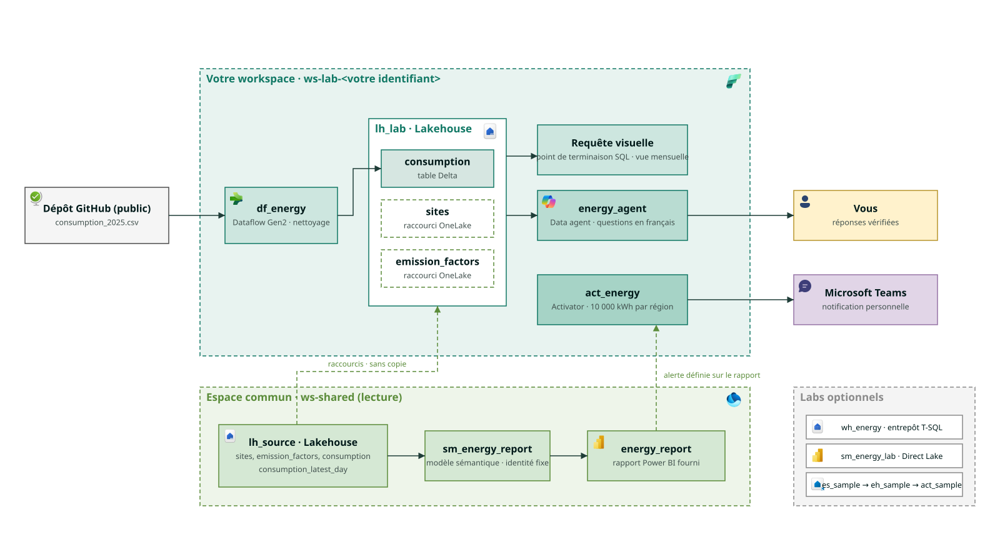

# Product Hands-on Lab - Microsoft Fabric de bout en bout

Un atelier hands-on réutilisable pour relier données, analyse et action dans Microsoft Fabric. Contoso, entreprise fictive multi-sites, suit l'énergie et l'empreinte carbone de ses bâtiments. Les données sont synthétiques et les facteurs carbone fictifs.

Le kit est conçu pour être animé par n'importe quel CSA, ou architecte de solutions cloud, dans un environnement autorisé. Aucun nom de client, URL de tenant, secret ou lien privé n'est intégré au contenu public.

**État : brouillon, `published: false`.** Les contrôles locaux ne remplacent pas une répétition sur tenant. Les trois schémas pédagogiques sont fournis ; les Labs 1 à 5 indiquent où ajouter les captures pendant le déroulé. Aucun fichier Power BI factice n'est fourni. Le parcours d'alerte depuis le rapport partagé est un test J-7 bloquant avant une session individuelle.

## Un parcours de 3 heures

Vous allez partir d'un fichier brut, préparer une table fiable, explorer ses données, poser vos questions à un agent et recevoir une alerte Teams. Le parcours principal réunit l'accueil, les Labs 1 à 5 et la conclusion, sans code à écrire : **145 min d'activités + 15 min de pause après le Lab 2 + 20 min d'aide = 180 min**.

Il s'adresse aux profils métiers, analystes, chefs de projet, contrôle de gestion et RSE. Pour une session à distance, prévoir 15 à 20 participants. Les cinq blocs « Contexte (optionnel) » de 5 min restent repliés, hors des 180 min.

Pour aller plus loin, ou composer une journée d'upskilling, choisir les labs optionnels à la carte :

| Lab optionnel | Sujet | Temps supplémentaire |
| --- | --- | ---: |
| Lab 6 | Entrepôt T-SQL | 30 min |
| Lab 7 | Modèle sémantique Direct Lake | 25 min |
| Lab 8 | Temps réel | 35 min |

Le **bonus Copilot** demande environ 15 minutes supplémentaires, si le temps et les paramètres du tenant le permettent. Ces options ne sont pas incluses dans les 3 heures.

La **variante S3** du Lab 1 demande 10 minutes supplémentaires, hors minutage, uniquement si elle est proposée dans la session.

Le Lab 2 conserve son créneau de 35 minutes avec exécution manuelle du pipeline ; la planification reste dans le contexte optionnel. La préparation de l'environnement et du rapport se fait avant la session.

## Architecture



Le schéma d'architecture se modifie dans [docs/architecture.drawio](docs/architecture.drawio) avec draw.io, puis s'exporte en PNG dans [docs/assets/00-architecture.png](docs/assets/00-architecture.png). Régénérer aussi [docs/assets/00-architecture.svg](docs/assets/00-architecture.svg) pour le README, en intégrant les images à l'export pour qu'il reste autonome. Les icônes de la source proviennent de la [collection Microsoft](https://aka.ms/MsiconsCollections).

Le fil rouge et le récapitulatif sont des SVG pédagogiques éditables dans [docs/assets/00-learning-path.svg](docs/assets/00-learning-path.svg) et [docs/assets/10-recap.svg](docs/assets/10-recap.svg). Ce sont des schémas, pas des captures d'exécution de Fabric.

## Ouvrir l'atelier

- [Rendu MOAW](https://aka.ms/ws?src=gh:aminelemsih/hands-on-lab-microsoft-fabric-end-to-end/main/docs/).
- [Source du workshop](docs/workshop.md).
- [Dépôt GitHub cible](https://github.com/aminelemsih/hands-on-lab-microsoft-fabric-end-to-end).
- [Mother Of All Workshops](https://aka.ms/moaw).

Le participant reçoit **un lien et se connecte, rien d'autre**. Les variables MOAW permettent d'adapter les noms et les liens sans modifier le contenu du dépôt. Exemple de session avec valeurs fictives :

[Ouvrir la session de démonstration Contoso](https://aka.ms/ws?src=gh:AmineLemsih/hands-on-lab-microsoft-fabric-end-to-end/main/docs/&vars=shared_ws:ws-shared,lab_ws:ws-lab-demo,teams_channel:Atelier%20Contoso,contact:Amine%20Lemsih)

Les valeurs par défaut permettent aussi de lire le workshop sans `vars`. Utiliser `&vars=` après le paramètre `src` ; encoder les valeurs et ne jamais y mettre de secret. La [préparation du lien de session](docs/facilitator-notes.md#lien-de-session) décrit les variables disponibles, dont `s3_shortcut` pour la variante facultative. Ce lien ne crée pas de workspace et ne donne pas de droits.

Le dépôt et les CSV synthétiques sont publics. `published: false` empêche le référencement dans le catalogue, **pas l'accès par lien direct** : ce n'est pas une protection de confidentialité. GitHub et MOAW peuvent mettre en cache brièvement une version précédente après un push.

## Prévisualisation locale

Prérequis animateur/auteur : Node.js 20 ou ultérieur et npm. Depuis la racine :

```powershell
npm i -g @moaw/cli
moaw serve docs
```

La CLI indique l'URL locale, ici `http://localhost:4444/workshop/docs/`. Si le port est occupé :

```powershell
moaw serve docs --port 4445
```

Contrôle de construction, après génération des données :

```powershell
moaw build docs/workshop.md -d data/out/workshop.build.md
```

Ajoutez les captures réelles anonymisées en remplaçant les lignes *[capture : …]* pendant le déroulé ; [docs/assets/SCREENSHOTS-TODO.md](docs/assets/SCREENSHOTS-TODO.md) décrit les 32 emplacements des Labs 1 à 5, limités aux écrans à risque et aux résultats à reconnaître. Exécutez ensuite `python tools/check_assets.py` pour synchroniser les références Markdown insérées. `--check --summary` contrôle l'état sans écrire ; les indications textuelles ne sont pas transformées automatiquement. Aucun fichier image vide ou fausse capture ne doit être ajouté.

## Pour les animateurs

Commencer par [docs/facilitator-notes.md](docs/facilitator-notes.md), puis préparer le lien de session avec les variables MOAW. Le participant reçoit un lien et se connecte, rien d'autre.

| Ressource | Utilisation |
| --- | --- |
| [setup/README.md](setup/README.md) | Préparer les workspaces et les accès ; simulation par défaut ; nettoyage confirmé |
| [data/README.md](data/README.md) | CSV publics régénérables et préparation des tables par notebook |
| [setup/setup_lh_source.ipynb](setup/setup_lh_source.ipynb) | Notebook Fabric à importer et attacher à `lh_source` |
| [report/README.md](report/README.md) | Construire et publier le vrai rapport fourni `energy_report` |
| [docs/assets/SCREENSHOTS-TODO.md](docs/assets/SCREENSHOTS-TODO.md) | Réaliser les captures anonymisées |

Les participants sont Membre dans leur espace `ws-lab-<email_local_part>` et Viewer dans l'espace commun `ws-shared`. Le groupe reçoit aussi le partage explicite ReadAll sur `lh_source`. Le modèle de `energy_report` utilise une connexion à identité fixe ; chaque participant enregistre son alerte dans son espace personnel, sans copier le rapport. Ce chemin est à répéter sur la capacité cible. L'option `--clone-report` reste désactivée et non implémentée tant que son API n'est pas validée.

Tous les identifiants techniques sont anglais : noms de fichiers, colonnes, tables et items. Le texte reste français. Ne traduisez pas `consumption` ni `emission_factors` dans une adaptation linguistique. Les chemins documentaires sont également anglais pour rester stables.

## Contrôles locaux

```powershell
python data/generate_data.py
python -m unittest discover -s data -p "test_*.py" -v
python -m unittest discover -s setup -p "test_*.py" -v
```

Attendus : 30 sites, une ligne de facteurs annuels avec deux coefficients, 10 950 lignes brutes, 110 rejets, 10 840 lignes propres, six pics historiques et 30 lignes par instantané. Toutes les régions sont sous 10 000 kWh dans l'état avant ; seule la Bretagne dépasse le seuil dans l'état après. Q4 conserve son seuil distinct de 20 000 kWh par site et jour.

Les six CSV synthétiques de `data/csv/` sont versionnés et régénérables, ainsi que [data/csv/expected_values.md](data/csv/expected_values.md). Les tests comparent les chiffres métier balisés dans le workshop à cette référence recalculée et détectent une dérive. Les paramètres réels restent exclus de Git. Le corrigé complet est calculé dans `data/csv/questions_expected_answers.md` et reste ignoré. Le dossier `data/out/` reste réservé aux sorties locales de construction. Aucun script n'est exécuté sur Fabric lors des tests locaux.

## Backlog

- **Simulateur de compteurs, script Python vers un endpoint personnalisé d'Eventstream.** La v1 utilise les données d'exemple intégrées, sans les présenter comme de l'énergie.
- Valider puis implémenter l'option facultative `--clone-report` avec les droits et le journal adaptés, sans en faire un prérequis du parcours nominal.
- Réaliser les captures et la répétition tenant avant de passer `published` à `true`.

## Auteur

**[Amine Lemsih](https://github.com/AmineLemsih)**  
Cloud Solution Architect Data & AI, Microsoft.

## Contributeurs

La liste [CONTRIBUTORS.md](CONTRIBUTORS.md) est volontairement vide à ce stade. Les contributions ne changent pas automatiquement la paternité indiquée dans les métadonnées.

## Contribuer

Utiliser les issues et demandes de tirage du dépôt. Indiquer le module, l'étape, le comportement attendu et le résultat constaté. Fournir uniquement des données synthétiques et des captures anonymisées. Maintenir les minutages, les identifiants anglais et les contrôles du jeu de données.

Conserver les balises `data-expected` autour des chiffres métier : elles relient chaque valeur à son calcul, sans changer son affichage. La [convention de vérification des chiffres](data/README.md#vérifier-les-chiffres-du-workshop) décrit comment ajouter une valeur et régénérer la référence.

Dans les Labs 1 à 5, regrouper les clics d'un écran en une étape, mettre les libellés d'interface en gras et les identifiants en code. Les indications *[capture : …]* précisent les écrans à ajouter. Les contrôles indiquent où regarder et les valeurs attendues dans un encadré `task`. Le menu utilise `navigation_numbering: false` et des titres explicites pour commencer à zéro. Pour éviter le tracking ajouté par MOAW aux liens Microsoft, utiliser une ancre HTML dont le protocole est écrit `https&#58;//` ; l'URL rendue reste une URL HTTPS normale, à vérifier dans le navigateur.

Conventions suivies, sans reprise du texte des exercices : le template et la [syntaxe MOAW](https://aka.ms/ws?src=create-workshop/), le lab Microsoft Agent Framework avec Microsoft Foundry, le workshop FabConRTI et les [exercices Microsoft Learn Fabric](https://microsoftlearning.github.io/mslearn-fabric/). Les modèles ne sont pas crédités comme co-auteurs de cet atelier.

## Licences

- **Code et extraits de code : MIT**, voir [LICENSE](LICENSE).
- **Contenu pédagogique, guides Markdown, données synthétiques et futures captures : CC BY-SA 4.0**, voir [docs/LICENSE](docs/LICENSE), y compris les guides situés hors du dossier docs.
- Les marques Microsoft et les ressources externes gardent leurs droits et conditions propres. Les facteurs fictifs n'accordent aucune validité à un reporting réel.

Attribution à reproduire : **« Product Hands-on Lab - Microsoft Fabric de bout en bout », Amine Lemsih, https://github.com/aminelemsih/hands-on-lab-microsoft-fabric-end-to-end, contenu sous CC BY-SA 4.0.** Indiquer les modifications lors d'une adaptation.