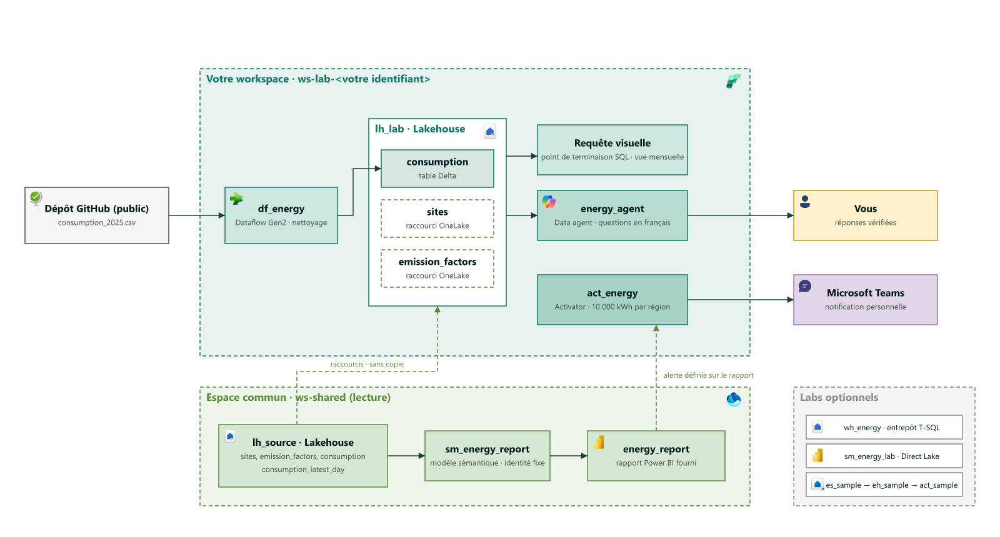

# Product Hands-on Lab - Microsoft Fabric de bout en bout

## 0. Introduction

**Durée : 10 minutes, dont environ 5 minutes de lecture.**

Contoso est une entreprise fictive qui possède des bureaux, des entrepôts, des usines et des agences. Elle veut comparer leur consommation énergétique et repérer les situations à examiner.

### Ce que vous allez construire

Vous préparez une analyse vérifiable, puis une alerte, à partir de données synthétiques.

**Fichier annuel → nettoyage visuel → table commune aux analyses → question métier → réponse vérifiée → décision.**

**Dernier jour disponible → rapport fourni → seuil dépassé → notification Teams personnelle.**

Le rapport vous est fourni dans l'espace commun. Les facteurs carbone sont fictifs et ne servent pas à un reporting réel.


### Modalités

| Parcours | Public et format | Sections | Temps réservé |
| --- | --- | --- | ---: |
| **Parcours métiers 3 h** | Analystes métier, chefs de projet, contrôle de gestion, RSE ; distanciel, 15 à 20 personnes | 0 à 5, puis 10 ; sauter les blocs « Comprendre » | 180 min |
| **Parcours complet 5 h** | Analystes et journée d'upskilling en présentiel | 0 à 8, puis 10 ; lire les cinq blocs « Comprendre » | 300 min |
| **Bonus Copilot** | Selon le temps disponible et les paramètres du tenant | 9 | Environ 15 min supplémentaires, hors des deux minutages |

### Prérequis participant

- Un navigateur récent, avec Fabric en français.
- Le compte professionnel indiqué sur votre fiche participant.
- Le rôle **Membre** sur votre workspace personnel.
- Le rôle **Lecteur** sur l'espace commun de votre fiche.
- L'accès Teams de votre fiche pour l'entraide et vos notifications personnelles.

<!-- TODO vérifier -->
<!-- TODO vérifier -->

### Conventions et aide

- Conservez les **identifiants en anglais**, même si le texte est français ; utilisez les liens et noms de workspace de votre fiche.
- Une ligne numérotée correspond à une action ; les libellés d'interface sont entre « guillemets ».
- Arrêtez-vous à chaque **point de contrôle** avant de poursuivre.
- Pour demander de l'aide, indiquez section, étape et message d'erreur au contact ou dans le canal de votre fiche ; en présentiel, signalez votre blocage.

<details>
<summary>Contexte (optionnel) : les briques utilisées</summary>

Un **workspace**, ou espace de travail, regroupe les éléments Fabric et leurs droits d'accès. Une **capacité** est la ressource de calcul partagée par ces éléments. Un **tenant** est l'environnement de votre organisation.

| Emplacement | Éléments | Votre usage |
| --- | --- | --- |
| Espace commun, nom générique `ws-shared` | `lh_source`, fichiers et tables de référence ; `energy_report` et son modèle `sm_energy_report` | Lecture. |
| Votre espace, nom générique `ws-lab-<email_local_part>` | `lh_lab`, `df_energy`, `pl_energy_daily`, `energy_agent`, `act_energy` | Création et modification de vos propres éléments. |
| Extensions, dans votre espace | `wh_energy`, `sm_energy_lab`, `es_sample`, `eh_sample`, `act_sample` | Entrepôt SQL, modèle d'analyse et flux d'exemple. |

**OneLake** est le stockage logique commun de Fabric. Un **lakehouse** organise des fichiers et des tables dans OneLake. Une **table Delta** est un ensemble de fichiers de données avec un journal assurant la cohérence des écritures.

Dans `lh_source`, la table `sites` (sites) décrit les bâtiments. La table `emission_factors` (facteurs d'émission) fournit deux coefficients par année. Vous créerez dans `lh_lab` la table `consumption` (consommation). La table `consumption_latest_day` (consommation du dernier jour disponible) est déjà préparée dans la source pour le rapport.

Un **raccourci OneLake** référence une table existante sans en créer une copie indépendante. **Dataflow Gen2** nettoie les données par des actions visuelles. Un **pipeline** enchaîne et planifie des activités. Un **data agent** transforme une question en requête sur les données autorisées. **Activator** surveille une condition et lance une action.

**Architecture textuelle :** `lh_source` référence → raccourcis dans `lh_lab` ; CSV → `df_energy` → `consumption` ; `pl_energy_daily` lance le flux ; SQL visuel et `energy_agent` lisent les tables. En parallèle, `lh_source` → `sm_energy_report` à identité fixe → `energy_report` → `act_energy` personnel → Teams.



**SSO**, ou authentification unique, signifie que le moteur utilise votre identité. Une **identité fixe** utilise celle d'une connexion autorisée, comme pour le modèle du rapport commun.

Les lakehouses, warehouses, tables et colonnes du lab utilisent des lettres, chiffres et underscores, sans espace ni tiret. Les tirets de `ws-lab-...` concernent le workspace. Les items comme `lh_lab` portent le même nom pour chacun, dans des workspaces séparés.

Un **kWh** mesure une quantité d'énergie. Un **kW** mesure une puissance. Un **kgCO2e** exprime une masse de gaz à effet de serre ramenée à un équivalent CO2. Multiplier les kWh par un facteur en kgCO2e/kWh donne une estimation en kgCO2e.

Le fichier annuel couvre l'année civile 2025. Le « dernier jour disponible » est le 31 décembre 2025, pas aujourd'hui. Les deux énergies sont additionnables en kWh, mais elles n'ont pas le même facteur carbone. Les lignes supprimées au nettoyage sont des observations manquantes, pas des consommations égales à zéro.

</details>

### Auteur

**Amine Lemsih** : conception et rédaction de l'atelier. Contact : **@aminelemsih**.

---

## 1. Prise en main

**Pourquoi c'est important pour Contoso**

Tous les sites doivent utiliser le même référentiel de bâtiments et les mêmes facteurs d'émission.  
Un raccourci évite les copies qui divergent entre équipes.

**Objectif :** créer votre lakehouse et accéder aux deux tables de référence sans les copier.

**Durée : 20 min de pratique ; 5 min « Comprendre » en parcours complet.**

### Ouvrir votre espace

1. Ouvrez le lien Fabric de votre fiche participant.
2. Connectez-vous avec le compte indiqué.
3. Sélectionnez « Espaces de travail ».
4. Ouvrez votre workspace personnel indiqué sur la fiche.
5. Vérifiez que vous n'êtes pas dans l'espace commun.
6. Sélectionnez « Nouvel élément ».
7. Recherchez « Lakehouse ».
8. Sélectionnez « Lakehouse ».
9. Saisissez `lh_lab` comme nom.
10. Laissez « Schémas de lakehouse » activé. <!-- TODO vérifier -->
11. Sélectionnez « Créer ».


### Créer les raccourcis

1. Développez « Tables » dans `lh_lab`.
2. Ouvrez le menu du schéma `dbo`. <!-- TODO vérifier -->
3. Sélectionnez « Nouveau raccourci ».
4. Choisissez « Microsoft OneLake ».
5. Sélectionnez le workspace commun indiqué sur votre fiche.
6. Sélectionnez `lh_source`.
7. Sélectionnez « Suivant ».
8. Développez les tables du schéma `dbo` de la source.
9. Cochez `sites`.
10. Cochez `emission_factors`.
11. Sélectionnez « Suivant ».
12. Vérifiez les deux noms de raccourcis.
13. Sélectionnez « Créer ».
14. Ouvrez le raccourci `sites`.
15. Repérez `site_id`, `region` et `opening_date` dans l'aperçu.
16. Ouvrez le raccourci `emission_factors`.
17. Repérez l'année 2025 et les deux coefficients.
18. Ouvrez les propriétés d'un raccourci. <!-- TODO vérifier -->
19. Vérifiez que la cible reste `lh_source` dans l'espace commun.

Si l'assistant ne permet qu'une sélection, créez `sites`, puis répétez les mêmes étapes pour `emission_factors`.


<div class="task" data-title="Point de contrôle">

> Vous devez voir `sites` et `emission_factors` sous `lh_lab`, avec l'indication de raccourci. Le référentiel contient 30 sites. Les facteurs contiennent une ligne pour 2025 et deux coefficients : 0,055 et 0,205. Vous n'avez lancé aucune activité de copie de ces tables.

</div>

### Variante : parcourir une source S3 (10 min, si votre fiche l'indique)

Cette variante est **hors minutage des deux parcours**. Suivez-la uniquement si votre fiche indique « Raccourci S3 disponible : oui ». Un **bucket S3** est un conteneur de fichiers dans un stockage objet. Son raccourci de démonstration est déjà disponible dans `lh_source`.

1. Ouvrez l'espace commun indiqué sur votre fiche.
2. Ouvrez `lh_source`.
3. Développez « Fichiers ».
4. Ouvrez le raccourci S3 à l'emplacement indiqué sur votre fiche.
5. Parcourez les fichiers de démonstration.
6. Revenez à votre workspace personnel.
7. Ouvrez `lh_lab`.
8. Ouvrez le menu de « Fichiers ».
9. Sélectionnez « Nouveau raccourci ».
10. Choisissez « Microsoft OneLake ».
11. Sélectionnez l'espace commun de votre fiche.
12. Sélectionnez `lh_source`.
13. Dans « Fichiers », sélectionnez le raccourci S3 déjà parcouru comme cible. <!-- TODO vérifier -->
14. Sélectionnez « Suivant ».
15. Conservez le nom du raccourci proposé.
16. Sélectionnez « Créer ».
17. Ouvrez le nouveau raccourci dans `lh_lab`.

<div class="task" data-title="Point de contrôle de la variante">

> Vous devez voir les mêmes fichiers de démonstration depuis `lh_source` et `lh_lab`, à travers les raccourcis, sans avoir lancé de copie.

</div>

### Si ça bloque

- **Source invisible :** vérifiez le tenant et le workspace indiqués sur votre fiche.
- **Données refusées :** transmettez le message d'accès refusé au contact de votre fiche.
- **Nom refusé ou schéma introuvable :** utilisez `lh_lab` ; cherchez `dbo` sous « Tables », pas sous « Fichiers ».

<details>
<summary>Comprendre : partager une référence, pas une copie (5 min)</summary>

Le raccourci stocke une référence vers la table source. Les moteurs consultent les données autorisées à cette cible. Les fichiers peuvent être mis en cache par les moteurs, mais il n'existe pas une seconde table métier indépendante à tenir à jour.

Utilisez ce mécanisme pour des référentiels ou des données gouvernées communes. Il ne remplace ni une sauvegarde ni un transfert de propriété. La suppression de la source ou le retrait des permissions peut casser la lecture du raccourci. Donner Membre dans votre workspace ne vous donne pas l'écriture sur la source commune.

</details>

---

## 2. Ingestion

**Pourquoi c'est important pour Contoso**

Les relevés énergétiques arrivent sous forme de fichiers imparfaits.  
Un nettoyage reproductible rend les analyses comparables d'un jour à l'autre.

**Objectif :** alimenter `consumption` avec un flux visuel et l'exécuter depuis un pipeline.

**Durée : 35 min de pratique ; 5 min « Comprendre » en parcours complet ; pause de 15 min ensuite.**

**Power Query** est l'éditeur de transformations visuelles utilisé par Dataflow Gen2. Une **destination** est la table dans laquelle le flux écrit son résultat.

### Créer le flux

1. Revenez à votre workspace personnel.
2. Sélectionnez « Nouvel élément ».
3. Recherchez « Dataflow Gen2 ».
4. Sélectionnez « Dataflow Gen2 ».
5. Nommez le flux `df_energy` dans le champ de nom proposé. <!-- TODO vérifier -->
6. Choisissez « Options → Paramètres régionaux du dataflow → Anglais (États-Unis) ». <!-- TODO vérifier -->
7. Ouvrez « Obtenir des données ».

Choisissez **une seule variante**, celle indiquée sur votre fiche. Elles utilisent le même fichier `consumption_2025.csv`.

### Variante A : fichier dans lh_source

1. Recherchez le connecteur « Lakehouse ».
2. Sélectionnez ce connecteur.
3. Choisissez l'authentification « Compte d'organisation ».
4. Sélectionnez « Se connecter » si nécessaire.
5. Sélectionnez « Suivant ».
6. Développez le workspace commun de votre fiche dans le navigateur de données.
7. Développez `lh_source`.
8. Développez « Fichiers ». <!-- TODO vérifier -->
9. Sélectionnez `consumption_2025.csv`.
10. Ouvrez son contenu binaire si le navigateur le présente comme « Binary ». <!-- TODO vérifier -->
11. Choisissez le format « Texte/CSV » si demandé.
12. Définissez la virgule comme séparateur.
13. Définissez UTF-8 comme encodage.
14. Sélectionnez « Créer » ou « Transformer les données » selon l'assistant. <!-- TODO vérifier -->


### Variante B : fichier dans SharePoint

1. Recherchez « Dossier SharePoint ».
2. Sélectionnez ce connecteur.
3. Saisissez l'URL du **site SharePoint** indiquée sur votre fiche, pas le lien de partage du fichier.
4. Choisissez « Compte d'organisation ».
5. Sélectionnez « Se connecter » si nécessaire.
6. Sélectionnez « Suivant ».
7. Ouvrez le filtre de la colonne `Name`.
8. Conservez uniquement `consumption_2025.csv`.
9. Ouvrez le filtre de `Folder Path`.
10. Conservez uniquement le dossier indiqué sur votre fiche.
11. Ouvrez la valeur binaire de la colonne `Content` de l'unique fichier retenu. <!-- TODO vérifier -->
12. Définissez la virgule comme séparateur.
13. Définissez UTF-8 comme encodage.
14. Ouvrez l'éditeur de transformation.


### Nettoyer et typer

Vous devez travailler sur six colonnes : `site_id`, `date`, `year`, `kwh_elec`, `kwh_gas`, `avg_temp`. Si la première ligne contient encore leurs noms, appliquez « Utiliser la première ligne pour les en-têtes ».

1. Renommez la requête `consumption`.
2. Ouvrez « Accueil ».
3. Ouvrez « Supprimer les lignes ».
4. Choisissez « Supprimer les lignes vides ».
5. Vérifiez les types détectés : `site_id` Texte, `date` Date, `year` Nombre entier, `kwh_elec`, `kwh_gas` et `avg_temp` Nombre décimal.
6. Corrigez uniquement un type incorrect avec l'icône de type de la colonne. <!-- TODO vérifier -->
7. Sélectionnez les six colonnes.
8. Ouvrez « Supprimer les lignes ».
9. Choisissez « Supprimer les erreurs ».
10. Sélectionnez `date`.
11. Ouvrez « Ajouter une colonne ».
12. Ouvrez « Date ».
13. Ouvrez « Mois ».
14. Choisissez « Début du mois ». <!-- TODO vérifier -->
15. Renommez la colonne ajoutée `month_start`.
16. Vérifiez que son type est « Date ».

La valeur `invalid` peut conduire à détecter `kwh_elec` comme Texte : corrigez alors cette colonne en Nombre décimal avant de supprimer les erreurs.


<div class="important" data-title="Une erreur n'est pas une consommation nulle">

> Le fichier contient 55 enregistrements vides et 55 valeurs `invalid`. Ne remplacez pas ces erreurs par zéro. Les 110 observations sont exclues de l'analyse. Les lignes à zéro avant l'ouverture d'un site sont valides et restent présentes. L'aperçu Power Query peut être limité : ne confondez pas son nombre de lignes avec le volume complet.

</div>

### Écrire dans le lakehouse

1. Sélectionnez la requête `consumption`.
2. Ouvrez « Ajouter une destination de données ».
3. Choisissez « Lakehouse ».
4. Sélectionnez votre workspace personnel.
5. Sélectionnez `lh_lab`.
6. Sélectionnez le schéma `dbo`.
7. Choisissez une nouvelle table.
8. Saisissez `consumption`.
9. Choisissez la méthode de mise à jour « Remplacer ». <!-- TODO vérifier -->
10. Vérifiez la correspondance des sept colonnes.
11. Validez la destination.
12. Sélectionnez « Publier » ou « Enregistrer et exécuter » selon la version. <!-- TODO vérifier -->
13. Exécutez le flux si la publication ne l'a pas déjà lancé.
14. Ouvrez son historique d'actualisation.
15. Attendez l'état de réussite.
16. Contrôlez les lignes écrites dans les détails de l'exécution. <!-- TODO vérifier -->
17. Ouvrez `lh_lab`.
18. Actualisez la liste de ses tables.
19. Ouvrez `consumption`.


### Orchestrer et exécuter

1. Revenez à votre workspace personnel.
2. Sélectionnez « Nouvel élément ».
3. Choisissez « Pipeline de données ».
4. Saisissez `pl_energy_daily`.
5. Sélectionnez « Créer ».
6. Ouvrez « Activités ».
7. Ajoutez une activité « Dataflow ».
8. Sélectionnez cette activité.
9. Ouvrez ses « Paramètres ».
10. Sélectionnez votre workspace.
11. Sélectionnez `df_energy`.
12. Enregistrez le pipeline.
13. Sélectionnez « Exécuter ».
14. Vérifiez la réussite de l'activité.


<div class="task" data-title="Point de contrôle">

> Vous devez voir la table `consumption` avec sept colonnes et **10 840 lignes** après nettoyage, ainsi que le flux et le pipeline réussis. Après l'exécution manuelle du pipeline, il reste 10 840 lignes : le mode « Remplacer » ne cumule pas les chargements.

</div>

### Si ça bloque

- **Fichier refusé ou import multiple :** vérifiez l'emplacement de votre fiche et les filtres `Name` et `Folder Path` ; signalez un accès refusé.
- **Décimaux ou dates en erreur :** vérifiez la locale de conversion et l'ordre des étapes.
- **Échec de destination ou doublons :** vérifiez votre workspace, `lh_lab` et la méthode « Remplacer ».

<details>
<summary>Comprendre : préparer les données et organiser le travail (5 min)</summary>

Dataflow Gen2 mémorise des transformations Power Query. À l'exécution, il relit la source et écrit le résultat. Le pipeline orchestre cette exécution ; il ne corrige pas lui-même le fichier.

Utilisez un flux pour des préparations récurrentes accessibles aux analystes. Utilisez un pipeline pour organiser plusieurs activités et leur calendrier. Le mode « Remplacer » convient au petit historique complet du lab. En production, il faut traiter les mises à jour incrémentales, les rejets, les responsabilités et le suivi des coûts. Une donnée absente n'est pas réparée par une planification.

Pour une exécution automatique facultative, ouvrez « Planifier » et choisissez « Quotidienne ». <!-- TODO vérifier -->  
Définissez l'heure, le fuseau et une date de fin adaptés à votre besoin.  
Enregistrez la planification ; ne l'activez que si vous souhaitez réellement ces exécutions.

</details>

<div class="info" data-title="Pause : 15 minutes">

> Faites une pause de 15 minutes. Laissez les éléments ouverts ; ne supprimez rien.

</div>

---

## 3. Exploration

**Pourquoi c'est important pour Contoso**

Les relevés de chaque site doivent pouvoir être comparés par région et par mois.  
Une analyse partagée rapproche les référentiels sans multiplier les observations.

**Objectif :** produire une vue des consommations électriques et de gaz par région et par mois, sans écrire de requête.

**Durée : 25 min de pratique ; 5 min « Comprendre » en parcours complet.**

Le **point de terminaison SQL** expose les tables Delta du lakehouse pour leur lecture avec SQL, un langage de requête. Une **jointure** rapproche des tables par une clé commune. Une **vue** conserve une définition de requête, pas une nouvelle copie des résultats.

### Ouvrir la requête visuelle

1. Ouvrez `lh_lab`.
2. Ouvrez « Analyser les données avec ». <!-- TODO vérifier -->
3. Choisissez « Point de terminaison d'analytique SQL ». <!-- TODO vérifier -->
4. Actualisez l'explorateur.
5. Vérifiez la présence de `consumption`, `sites` et `emission_factors`.
6. Sélectionnez « Nouvelle requête visuelle ».
7. Nommez-la `q_energy_monthly`.
8. Faites glisser `consumption` sur le canevas.
9. Faites glisser `sites` sur le canevas.
10. Faites glisser `emission_factors` sur le canevas.

### Rapprocher les tables

1. Ouvrez le menu du bloc `consumption`.
2. Sélectionnez « Fusionner les requêtes ». <!-- TODO vérifier -->
3. Choisissez `sites` comme seconde table.
4. Sélectionnez `site_id` dans la première table.
5. Sélectionnez `site_id` dans la seconde table.
6. Choisissez la jointure « Externe gauche ».
7. Validez.
8. Ouvrez le bouton de développement de la colonne issue de `sites`.
9. Conservez seulement `region`.
10. Décochez l'option de préfixe du nom de colonne. <!-- TODO vérifier -->
11. Validez.
12. Ouvrez le menu du résultat fusionné.
13. Sélectionnez « Fusionner les requêtes ».
14. Choisissez `emission_factors` comme seconde table.
15. Sélectionnez `year` dans la première table.
16. Sélectionnez `year` dans la seconde table.
17. Choisissez « Externe gauche ».
18. Validez.
19. Développez la colonne issue de `emission_factors`.
20. Conservez `elec_kgco2e_per_kwh`.
21. Conservez aussi `gas_kgco2e_per_kwh`.
22. Décochez l'option de préfixe.
23. Validez.

La table des facteurs possède **une seule ligne par année**, avec deux colonnes de coefficients. Chaque observation doit donc rester une seule observation après la jointure. Ne joignez jamais les deux énergies comme deux lignes sans adapter le schéma.


### Regrouper les consommations

<!-- TODO vérifier -->
<!-- TODO vérifier -->
<!-- TODO vérifier -->

1. Sélectionnez « Regrouper par ».
2. Choisissez le mode « Avancé ».
3. Ajoutez `region` comme première clé.
4. Ajoutez `month_start` comme seconde clé.
5. Ajoutez `total_kwh_elec`, opération « Somme », sur `kwh_elec`.
6. Ajoutez `total_kwh_gas`, opération « Somme », sur `kwh_gas`.
7. Ajoutez `observation_count`, opération « Nombre de lignes ».
8. Validez.

### Enregistrer la vue

1. Sélectionnez la dernière étape du résultat agrégé.
2. Vérifiez « Activer le chargement » dans son menu. <!-- TODO vérifier -->
3. Sélectionnez « Enregistrer comme vue ».
4. Choisissez le schéma `dbo`.
5. Saisissez `v_energy_monthly`.
6. Confirmez l'enregistrement.
7. Actualisez l'explorateur.
8. Ouvrez la vue créée.

Une vue SQL ne garantit pas l'ordre de ses lignes. <!-- TODO vérifier -->


<div class="task" data-title="Point de contrôle">

> Vous devez voir `v_energy_monthly`, avec **72 couples région/mois**, `total_kwh_elec`, `total_kwh_gas` et `observation_count`. La somme des `observation_count` vaut **10 840**. Les jointures ne doivent pas doubler les observations.

</div>

### Si ça bloque

- **Table absente en SQL :** vérifiez la table ou le raccourci dans le lakehouse, puis actualisez l'explorateur après la synchronisation.
- **Totaux doublés ou facteurs vides :** vérifiez les clés `site_id` et `year`, leurs types et l'unicité de `emission_factors.year`.
- **Vue impossible à enregistrer :** sélectionnez le résultat regroupé et transmettez le message avec le nom de l'étape concernée.

<details>
<summary>Variante T-SQL (optionnelle, hors parcours métiers sans code)</summary>

Sur le **point de terminaison SQL** de `lh_lab`, ouvrez une nouvelle requête SQL. La variante utilise les mêmes tables et la même définition métier. Le schéma est `dbo`.

```sql
-- Créer ou remplacer la définition, sans copier les résultats.
CREATE OR ALTER VIEW dbo.v_energy_monthly AS
SELECT
    sites.region,
    consumption.month_start,
    COUNT_BIG(*) AS observation_count,
    SUM(consumption.kwh_elec + consumption.kwh_gas) AS total_kwh,
    SUM(consumption.kwh_elec * factors.elec_kgco2e_per_kwh
      + consumption.kwh_gas * factors.gas_kgco2e_per_kwh) AS kgco2e
FROM dbo.consumption AS consumption
LEFT JOIN dbo.sites AS sites
    ON sites.site_id = consumption.site_id
LEFT JOIN dbo.emission_factors AS factors
    ON factors.[year] = consumption.[year]
GROUP BY sites.region, consumption.month_start;
```

Exécutez cette seconde requête séparément :

```sql
-- Le tri est une propriété de la lecture, pas de la vue.
SELECT region, month_start, observation_count,
       ROUND(total_kwh, 2) AS total_kwh,
       ROUND(kgco2e, 2) AS kgco2e
FROM dbo.v_energy_monthly
ORDER BY kgco2e DESC, region, month_start;
```

</details>

<details>
<summary>Comprendre : une même donnée, plusieurs lectures (5 min)</summary>

Le point de terminaison SQL lit les tables Delta. Il peut conserver une définition de vue, mais ne permet pas d'écrire les relevés comme un warehouse. Le lakehouse et la vue ne sont donc pas deux bases contenant deux copies des consommations.

La vue visuelle conserve séparément les kWh électriques et de gaz. Le calcul en kgCO2e reste dans la variante T-SQL repliée, les instructions de l'agent en section 4 et la mesure DAX en section 7. Exécuter la variante T-SQL remplace `v_energy_monthly` par sa version avec calcul carbone : choisissez une variante, pas deux définitions à cumuler.

Utilisez la vue pour une logique de lecture partagée. Le calcul carbone dépend de la validité des clés et des coefficients. Le moteur ne sait pas qu'une jointure a doublé vos résultats. Une vue agrégée perd aussi le détail : le data agent doit conserver l'accès aux tables pour retrouver un jour anormal.

</details>

---

## 4. Data agent

**Pourquoi c'est important pour Contoso**

Les équipes métiers veulent interroger les données avec leurs propres mots.  
Les définitions et les contrôles évitent qu'une réponse plausible devienne une décision erronée.

**Objectif :** améliorer et vérifier les réponses de `energy_agent` à six questions métier.

**Durée : 30 min de pratique ; 5 min « Comprendre » en parcours complet.**

### Créer l'agent

1. Revenez à votre workspace personnel.
2. Sélectionnez « Nouvel élément ».
3. Recherchez « Agent de données Fabric ». <!-- TODO vérifier -->
4. Sélectionnez cet élément.
5. Saisissez `energy_agent`.
6. Sélectionnez « Créer ».
7. Choisissez `lh_lab` dans le catalogue des sources.
8. Sélectionnez « Ajouter ».
9. Cochez `consumption` dans l'explorateur de l'agent.
10. Cochez `sites`.
11. Cochez `emission_factors`.
12. Décochez les autres tables ou vues si elles sont proposées.


### Poser les six questions avant configuration

1. Posez Q1 dans la zone de conversation.
2. Développez les étapes de la réponse. <!-- TODO vérifier -->
3. Repérez la source choisie et la requête générée, sans la modifier.
4. Notez le résultat et l'unité dans votre fiche de comparaison privée.
5. Répétez ces quatre actions pour Q2 à Q6, dans l'ordre.

| Question | Texte à poser |
| --- | --- |
| Q1 | Quelle est la consommation électrique totale observée en 2025, en kWh ? |
| Q2 | Quelle région émet le plus de kgCO2e en 2025, électricité et gaz réunis ? |
| Q3 | Quel mois de 2025 a la consommation totale la plus élevée, en kWh ? |
| Q4 | Quels couples site et jour dépassent 20 000 kWh, électricité et gaz réunis, en 2025 ? |
| Q5 | Combien de sites étaient actifs au 1er janvier 2025 ? |
| Q6 | De quel pourcentage nos émissions ont-elles baissé entre 2024 et 2025 ? |

Pour Q2, cherchez dans les étapes l'usage des deux facteurs. Pour Q4, vérifiez que le seuil s'applique à un **site et un jour**, pas à une somme régionale. Pour Q6, vérifiez que l'agent reconnaît l'absence de 2024.

### Ajouter les définitions métier

1. Ouvrez « Instructions de l'agent de données ». <!-- TODO vérifier -->
2. Collez les instructions en français ci-dessous.
3. Enregistrez les instructions.

> Répondez en français. Utilisez uniquement les tables sélectionnées de lh_lab. Indiquez la période, l'unité, les tables et les limites des résultats.
>
> Les consommations kwh_elec et kwh_gas sont des énergies journalières en kWh, pas des puissances. La consommation totale est leur somme. L'année est l'année civile, du 1er janvier inclus au 1er janvier suivant exclu. Pour ce jeu, seule 2025 est disponible.
>
> Un site est actif à une date si opening_date est antérieure ou égale à cette date. Aucune fermeture n'est modélisée. Comptez les sites depuis sites, sans compter plusieurs fois les relevés quotidiens. Ne confondez pas site actif et consommation non nulle.
>
> Reliez consumption.site_id à sites.site_id. Reliez consumption.year à emission_factors.year, unique par année. Utilisez elec_kgco2e_per_kwh pour l'électricité et gas_kgco2e_per_kwh pour le gaz. Additionnez les deux contributions en kgCO2e. Arrondissez après la somme. Les facteurs sont fictifs, ne pas utiliser pour un reporting réel.
>
> Les 110 observations rejetées au nettoyage sont absentes. Les totaux portent sur les observations conservées ; n'inventez pas leurs valeurs. Les six pics sont présents dans les données nettoyées. Pour une anomalie journalière, comparez la somme des deux énergies au seuil par couple site/date.
>
> Si une période ou une information manque, dites-le et demandez les données nécessaires. N'inventez pas de résultat pour 2024, de pourcentage de baisse, de cause de panne ou de facteur d'émission externe.

### Ajouter un exemple sans écrire de code

Un **exemple de requête** associe une question à une requête déjà vérifiée. La requête Q1 validée est fournie dans votre fiche participant ; vous n'avez pas à l'écrire.

1. Ouvrez la rubrique « Requête Q1 validée pour l'exemple » de votre fiche.
2. Copiez la requête fournie.
3. Ouvrez « Exemples de requêtes ». <!-- TODO vérifier -->
4. Sélectionnez la source `lh_lab`.
5. Sélectionnez « Ajouter un exemple ».
6. Saisissez Q1 comme question.
7. Collez la requête de votre fiche dans le champ de requête.
8. Lancez la validation de l'exemple. <!-- TODO vérifier -->
9. Enregistrez seulement si la validation réussit.

Ne prenez pas une requête qui échoue ou une réponse textuelle comme exemple SQL.

### Comparer après configuration

1. Notez vos réponses initiales avant d'effacer la conversation.
2. Sélectionnez « Effacer la conversation ». <!-- TODO vérifier -->
3. Reposez Q1 à Q6.
4. Examinez les sources, requêtes et unités de chaque nouvelle réponse.
5. Complétez la comparaison privée.
6. Comparez avec le corrigé communiqué par l'animateur.

| Question | Résultat avant | Résultat après | Période et unité justes ? | Conforme au corrigé ? |
| --- | --- | --- | --- | --- |
| Q1 | À noter | À noter | À noter | À noter |
| Q2 | À noter | À noter | À noter | À noter |
| Q3 | À noter | À noter | À noter | À noter |
| Q4 | À noter | À noter | À noter | À noter |
| Q5 | À noter | À noter | À noter | À noter |
| Q6 | À noter | À noter | À noter | À noter |


<div class="task" data-title="Point de contrôle">

> Vous devez voir les trois tables de l'agent, des instructions enregistrées et un exemple validé. Q4 doit retrouver six couples site/jour. Q5 doit compter 27 sites actifs au 1er janvier. Q6 doit signaler que le pourcentage est impossible à calculer sans 2024. Une erreur persistante est un résultat de test à documenter, pas à masquer.

</div>

### Si ça bloque

- **Élément agent absent :** vérifiez votre workspace, puis signalez l'absence au contact de votre fiche.
- **Source vide ou refusée :** vérifiez les trois tables cochées et leur visibilité dans le point de terminaison SQL.
- **Réponse ou exemple incorrect :** comparez les noms de tables et de colonnes de la requête avec votre source, puis signalez l'écart. <!-- TODO vérifier -->

<details>
<summary>Comprendre : guider une réponse, pas garantir la vérité (5 min)</summary>

Le data agent s'appuie sur les schémas, les instructions et les exemples pour produire une requête. Le moteur de données exécute cette requête avec les autorisations applicables. Fabric gère le service d'IA intégré ; vous ne fournissez pas une clé Azure OpenAI dans ce lab.

Utilisez-le pour retrouver des faits et explorer des questions bien définies. Il ne remplace pas un contrôle des résultats, une définition d'indicateur ni une analyse causale. L'exemple aide pour certaines formes de questions ; il ne garantit pas les réponses suivantes. Des données absentes restent absentes, même après une meilleure instruction.

</details>

---

## 5. Alerte

**Pourquoi c'est important pour Contoso**

Une dérive peut rester invisible entre deux consultations du rapport.  
Une notification invite la bonne personne à examiner la situation au moment du dépassement.

**Objectif :** enregistrer une alerte personnelle sur le rapport partagé et observer son déclenchement.

**Durée : 15 min de pratique ; 5 min « Comprendre » en parcours complet.**

### Ouvrir le rapport commun

1. Ouvrez le lien du rapport indiqué sur votre fiche participant.
2. Vérifiez que le rapport est `energy_report` dans l'espace commun.
3. Repérez le visuel **« consommation du dernier jour disponible par région »**.
4. Vérifiez que le dernier jour disponible affiché est le 31 décembre 2025.
5. Vérifiez que toutes les régions sont sous **10 000 kWh** dans l'état de départ.

Ne copiez pas le rapport. Vous restez lecteur dans l'espace commun. L'alerte, elle, sera enregistrée dans votre workspace personnel.


### Définir votre règle

1. Ouvrez le menu « … » du visuel en barres.
2. Sélectionnez « Définir une alerte » ou « Ajouter une alerte ». <!-- TODO vérifier -->
3. Vérifiez la mesure `latest_day_kwh` dans le volet.
4. Vérifiez que la condition est évaluée pour chaque `region`.
5. Choisissez « Devient » dans la condition. <!-- TODO vérifier -->
6. Choisissez « Supérieur à ».
7. Saisissez `10000`.
8. Choisissez « Teams » comme canal de notification.
9. Choisissez votre propre compte comme destinataire.
10. Ouvrez « Sélectionner l'emplacement d'enregistrement ». <!-- TODO vérifier -->
11. Sélectionnez votre workspace personnel de la fiche.
12. Choisissez un nouvel élément Activator.
13. Nommez-le `act_energy`.
14. Confirmez l'emplacement.
15. Sélectionnez « Appliquer » ou « Créer » selon le volet. <!-- TODO vérifier -->
16. Vérifiez que l'alerte est active.

Le canal Teams de l'atelier sert à l'entraide. Il n'est **pas** le destinataire de cette alerte : vous vous envoyez un message personnel.


<!-- TODO vérifier -->

### Voir le déclenchement et ouvrir Activator

1. Signalez à l'animateur que votre règle est active.
2. Attendez sa confirmation que l'état sous le seuil a été observé.
3. Observez le changement des barres dans le rapport actualisé.
4. Ouvrez vos notifications Teams.
5. Repérez le message de dépassement pour la région concernée.
6. Revenez au volet d'alerte du rapport.
7. Ouvrez le menu de l'élément Activator.
8. Sélectionnez « Ouvrir dans Activator ». <!-- TODO vérifier -->
9. Ouvrez la règle dans `act_energy`.
10. Repérez la valeur observée, la condition, le destinataire et l'historique des actions. <!-- TODO vérifier -->

Vous ne modifiez pas les données communes. Rafraîchir la page du navigateur n'actualise pas le modèle sémantique.


<div class="info" data-title="Sous le capot">

> Le même moteur Activator peut surveiller des flux temps réel et des événements Fabric. Selon la source, les permissions et les actions configurées, il peut envoyer un courriel, appeler un flux Power Automate ou déclencher un élément Fabric tel qu'un pipeline, sans code. Ce lab configure seulement une notification personnelle. La section 8 compare cette alerte sur rapport à une règle sur flux.

</div>

<div class="task" data-title="Point de contrôle">

> Vous devez voir `act_energy` dans **votre** workspace, une règle par région sur `latest_day_kwh`, le seuil de 10 000 kWh et votre compte comme destinataire. Après l'actualisation, une région franchit le seuil et une notification Teams vous est envoyée.

</div>

### Si ça bloque

- **Bouton absent ou destination refusée :** vérifiez le workspace personnel choisi, puis transmettez le message au contact de votre fiche.
- **Rapport inchangé :** signalez que les barres n'ont pas changé et conservez votre règle active.
- **Pas de notification :** vérifiez la règle active, la région, votre destinataire et les deux états observés dans l'historique.

<details>
<summary>Comprendre : surveiller un état et déclencher une action (5 min)</summary>

Une règle combine des observations, une condition et une action. « Devient supérieur à » recherche un franchissement, pas simplement une valeur qui reste élevée. Le jeu avant/après crée ce changement de manière contrôlée.

Utilisez une alerte pour inviter à une vérification ou automatiser une réponse autorisée. Sur un rapport, le délai dépend de l'actualisation du modèle et de l'évaluation de la règle. Ce n'est pas la même latence qu'un événement reçu dans un flux. Une notification ne prouve pas une panne et ne doit pas engager une action irréversible sans contrôle adapté.

</details>

**Parcours métiers :** passez maintenant à la section 10, « Conclusion ». **Parcours complet :** poursuivez avec l'extension Entrepôt.

---

## 6. Extension : Entrepôt et T-SQL

**Pourquoi c'est important pour Contoso**

Certaines équipes souhaitent gérer leurs analyses avec des tables et des requêtes SQL.  
Un entrepôt leur fournit une surface d'écriture et de lecture adaptée à cette pratique.

**Objectif :** copier les données propres dans un warehouse et vérifier trois requêtes T-SQL.

**Durée : 20 min, parcours complet uniquement.**

Un **warehouse**, ou entrepôt, est un stockage analytique organisé en tables et piloté par SQL. **T-SQL** est le dialecte SQL utilisé par le warehouse Fabric. À partir de cette extension, des requêtes commentées sont fournies à copier-coller.

### Charger les tables en T-SQL

1. Ouvrez votre workspace personnel.
2. Sélectionnez « Nouvel élément ».
3. Choisissez « Warehouse » ou « Entrepôt ». <!-- TODO vérifier -->
4. Saisissez `wh_energy`.
5. Sélectionnez « Créer ».
6. Ouvrez une « Nouvelle requête SQL » dans `wh_energy`.
7. Collez les trois instructions ci-dessous dans l'éditeur.
8. Sélectionnez uniquement la première instruction, jusqu'au point-virgule.
9. Sélectionnez « Exécuter ».
10. Sélectionnez uniquement la deuxième instruction.
11. Sélectionnez « Exécuter ».
12. Sélectionnez uniquement la troisième instruction.
13. Sélectionnez « Exécuter ».
14. Actualisez l'explorateur du warehouse.
15. Vérifiez la présence de `consumption`, `sites` et `emission_factors` sous `dbo`.

Le nom en trois parties désigne le lakehouse `lh_lab` du même workspace, son schéma `dbo` et sa table. <!-- TODO vérifier -->

```sql
-- Copier l'historique nettoyé dans une nouvelle table du warehouse.
CREATE TABLE dbo.consumption AS
SELECT * FROM lh_lab.dbo.consumption;

-- Copier le référentiel des sites, lu à travers le raccourci du lakehouse.
CREATE TABLE dbo.sites AS
SELECT * FROM lh_lab.dbo.sites;

-- Copier les deux facteurs annuels, sans modifier leur précision.
CREATE TABLE dbo.emission_factors AS
SELECT * FROM lh_lab.dbo.emission_factors;
```

Les types de destination sont déduits de la sélection ; vérifiez les dates et les nombres dans l'explorateur. <!-- TODO vérifier --> Ces instructions créent des tables nouvelles : si une table existe déjà, ne la supprimez pas et passez à son contrôle avant de relancer sa création.

<!-- TODO vérifier -->
<!-- TODO vérifier -->
<!-- TODO vérifier -->
<!-- TODO vérifier -->

### Exécuter trois requêtes guidées

1. Ouvrez `wh_energy`.
2. Sélectionnez « Nouvelle requête SQL ».
3. Collez la requête 1.
4. Sélectionnez « Exécuter ».
5. Comparez le nombre de lignes et la somme électrique au corrigé.

```sql
-- Requête 1 : contrôler le volume et les totaux observés en 2025.
SELECT COUNT_BIG(*) AS observation_count,
       ROUND(SUM(kwh_elec), 2) AS electricity_kwh,
       ROUND(SUM(kwh_gas), 2) AS gas_kwh
FROM dbo.consumption
WHERE [date] >= '2025-01-01' AND [date] < '2026-01-01';
```

Vous attendez **10 840 observations**, **2 896 164,51 kWh électriques** et **1 686 455,14 kWh de gaz**.

1. Ouvrez une seconde requête SQL.
2. Collez la requête 2.
3. Exécutez-la.
4. Comparez le classement régional à la réponse Q2 de l'agent.

```sql
-- Requête 2 : appliquer le facteur de chaque énergie pour la bonne année.
SELECT sites.region,
       ROUND(SUM(consumption.kwh_elec * factors.elec_kgco2e_per_kwh
               + consumption.kwh_gas * factors.gas_kgco2e_per_kwh), 2) AS total_kgco2e
FROM dbo.consumption AS consumption
JOIN dbo.sites AS sites ON sites.site_id = consumption.site_id
JOIN dbo.emission_factors AS factors ON factors.[year] = consumption.[year]
WHERE consumption.[date] >= '2025-01-01' AND consumption.[date] < '2026-01-01'
GROUP BY sites.region
ORDER BY total_kgco2e DESC, sites.region;
```

Les Hauts-de-France arrivent en tête, avec **133 453,59 kgCO2e fictifs**. Un résultat deux fois trop grand indique une erreur de données ou de jointure, pas une nouvelle découverte métier.

1. Ouvrez une troisième requête SQL.
2. Collez la requête 3.
3. Exécutez-la.
4. Comparez les six couples au corrigé de Q4.

```sql
-- Requête 3 : chercher les dépassements au grain site/jour, pas région/an.
SELECT consumption.site_id, sites.site_name, consumption.[date],
       consumption.kwh_elec + consumption.kwh_gas AS total_kwh
FROM dbo.consumption AS consumption
JOIN dbo.sites AS sites ON sites.site_id = consumption.site_id
WHERE consumption.[date] >= '2025-01-01' AND consumption.[date] < '2026-01-01'
  AND consumption.kwh_elec + consumption.kwh_gas > 20000
ORDER BY total_kwh DESC, consumption.site_id, consumption.[date];
```

### Conserver une vue

1. Ouvrez une nouvelle requête SQL dans `wh_energy`.
2. Collez cette définition.
3. Exécutez-la seule.
4. Actualisez l'explorateur.
5. Ouvrez `dbo.v_energy_monthly`.

```sql
-- Cette vue est dans le warehouse, distincte de celle du lakehouse.
CREATE OR ALTER VIEW dbo.v_energy_monthly AS
SELECT sites.region, consumption.month_start,
       SUM(consumption.kwh_elec + consumption.kwh_gas) AS total_kwh,
       SUM(consumption.kwh_elec * factors.elec_kgco2e_per_kwh
         + consumption.kwh_gas * factors.gas_kgco2e_per_kwh) AS kgco2e
FROM dbo.consumption AS consumption
JOIN dbo.sites AS sites ON sites.site_id = consumption.site_id
JOIN dbo.emission_factors AS factors ON factors.[year] = consumption.[year]
GROUP BY sites.region, consumption.month_start;
```


### Lakehouse ou warehouse ?

| Besoin | Choix à examiner |
| --- | --- |
| Fichiers variés, préparation de données, raccourcis OneLake, travail Spark | Lakehouse |
| Équipe SQL, tables analytiques, écritures T-SQL et transactions entre tables | Warehouse |
| Lire les tables du lakehouse en SQL sans les copier | Point de terminaison SQL du lakehouse |
| Partager des indicateurs Power BI | Modèle sémantique sur la source adaptée |

Dans cette extension, vous avez **copié** les tables pour apprendre l'entrepôt. Ce n'est pas une obligation de toute architecture Fabric.

<div class="task" data-title="Point de contrôle">

> Vous devez voir les trois tables et `v_energy_monthly` dans `wh_energy`. `consumption` contient 10 840 lignes, `sites` 30 et `emission_factors` une. Les trois requêtes retrouvent les valeurs attendues.

</div>

### Si ça bloque

- **Écriture SQL refusée :** vérifiez que vous êtes dans `wh_energy`, pas dans le point de terminaison SQL du lakehouse.
- **Source introuvable :** vérifiez `lh_lab` dans le même workspace et les tables de son point de terminaison SQL.
- **Table déjà existante :** contrôlez son contenu sans relancer sa création ni la supprimer.

<details>
<summary>Contexte (optionnel) : copier par pipeline</summary>

Un pipeline peut aussi copier ces tables avec une activité « Copier les données ».
La source est `lh_lab` et la destination est `wh_energy`, dans votre espace.
Les activités `copy_consumption`, `copy_sites` et `copy_emission_factors` peuvent être regroupées dans `pl_energy_warehouse`.
Ce mécanisme convient à des copies récurrentes dont vous suivez les exécutions.
Dans cet exercice, les trois instructions T-SQL suffisent : aucun pipeline supplémentaire n'est à créer.


</details>

<details>
<summary>Contexte (optionnel) : le choix appartient au besoin</summary>

Lakehouse et warehouse partagent OneLake, mais n'ont pas la même surface d'écriture. Choisissez en fonction des compétences, des formats et de la façon de gérer les données. Multiplier les copies augmente aussi les contrôles à maintenir.

</details>

---

## 7. Extension : Modèle sémantique Direct Lake

**Pourquoi c'est important pour Contoso**

Le même indicateur carbone doit garder sa définition d'un rapport à une conversation.  
Un modèle partagé rend explicites les relations, les unités et les calculs.

**Objectif :** créer un modèle Direct Lake sur `lh_lab` et l'interroger depuis le data agent.

**Durée : 25 min, parcours complet uniquement.**

Un **modèle sémantique** décrit les relations et les mesures utilisées pour analyser les données. **Direct Lake** permet au moteur Power BI de lire les tables Delta de OneLake sans construire une copie Import complète. Une **mesure DAX** est un calcul évalué selon les filtres de l'analyse.

### Créer explicitement le modèle

1. Ouvrez `lh_lab`.
2. Sélectionnez « Nouveau modèle sémantique ». <!-- TODO vérifier -->
3. Saisissez `sm_energy_lab`.
4. Choisissez votre workspace personnel.
5. Sélectionnez `consumption`.
6. Sélectionnez `sites`.
7. Sélectionnez `emission_factors`.
8. Créez le modèle.
9. Ouvrez le modèle en modification. <!-- TODO vérifier -->
10. Vérifiez le mode de stockage « Direct Lake » des tables.
11. Vérifiez que le mode de connexion de ce modèle personnel utilise SSO. <!-- TODO vérifier -->

Ne sélectionnez pas `v_energy_monthly` : c'est une vue SQL, pas une table Delta physique. Une vue peut entraîner un chemin DirectQuery selon le type de modèle. **DirectQuery** interroge la source à chaque requête au lieu de charger ses colonnes en mémoire comme Direct Lake.

Il n'est pas nécessaire qu'un modèle par défaut existe dans le lakehouse. Vous venez d'en créer un explicitement. Les trois tables incluent les tables référencées par raccourci.

### Définir les relations

1. Ouvrez la vue « Modèle ».
2. Choisissez « Gérer les relations ». <!-- TODO vérifier -->
3. Créez une relation de `consumption.site_id` vers `sites.site_id`.
4. Choisissez la cardinalité « Plusieurs à un ».
5. Choisissez le filtrage « Simple », depuis `sites` vers `consumption`.
6. Laissez la relation active.
7. Enregistrez cette relation.
8. Créez une relation de `consumption.year` vers `emission_factors.year`.
9. Choisissez « Plusieurs à un ».
10. Choisissez le filtrage « Simple », depuis `emission_factors` vers `consumption`.
11. Laissez cette relation active.
12. Enregistrez.

S'il existe déjà une relation identique créée automatiquement, vérifiez-la au lieu d'en ajouter une seconde. `sites.site_id` et `emission_factors.year` doivent être uniques.

### Ajouter la mesure carbone

1. Sélectionnez `consumption` dans le modèle.
2. Choisissez « Nouvelle mesure ».
3. Collez la mesure ci-dessous.
4. Validez la formule.
5. Définissez son format numérique à deux décimales.
6. Ajoutez la description « Estimation fictive en kgCO2e, électricité et gaz, sur les observations disponibles ».
7. Enregistrez le modèle.

```dax
total_kgco2e =
// RELATED utilise la relation active vers l'unique ligne de facteurs de l'année.
SUMX(
    consumption,
    consumption[kwh_elec] * RELATED(emission_factors[elec_kgco2e_per_kwh])
        + consumption[kwh_gas] * RELATED(emission_factors[gas_kgco2e_per_kwh])
)
```

Le format d'affichage arrondit le résultat final. Ne remplacez pas cette expression par un arrondi des émissions de chaque observation.


### Ajouter le modèle à l'agent

1. Ouvrez `energy_agent`.
2. Sélectionnez « Ajouter une source de données ».
3. Choisissez `sm_energy_lab`.
4. Sélectionnez « Ajouter ».
5. Complétez les instructions : « Pour les émissions agrégées, utilisez sm_energy_lab et la mesure total_kgco2e. Ne cumulez pas les résultats de ce modèle et de lh_lab : ils représentent les mêmes données. »
6. Enregistrez.
7. Démarrez une nouvelle conversation.
8. Reposez Q2 en précisant : « Utilisez uniquement sm_energy_lab et sa mesure total_kgco2e. »
9. Vérifiez la source et la requête DAX affichées dans les étapes.
10. Comparez la réponse à Q2 et à la requête SQL de la section 6.

Les exemples de requêtes SQL/KQL ne sont pas configurables pour une source modèle sémantique comme pour un lakehouse. Cela n'empêche pas l'agent de l'interroger. Ses mesures et métadonnées portent la définition métier.


<div class="task" data-title="Point de contrôle">

> Vous devez voir les deux relations plusieurs-vers-un et la mesure `total_kgco2e`. Le total 2025 vaut **505 012,35 kgCO2e fictifs**, et Q2 retrouve **133 453,59 kgCO2e** pour les Hauts-de-France. La trace de l'agent doit montrer le modèle choisi, pas une addition de deux sources.

</div>

### Si ça bloque

- **Relation impossible :** vérifiez les types des clés et l'absence de doublons du côté « un ».
- **Accès Direct Lake refusé :** ouvrez la table source du raccourci et transmettez le message d'accès refusé au contact de votre fiche.
- **Mesure ou source absente :** vérifiez l'enregistrement de `sm_energy_lab` et sa sélection dans l'agent.

<div class="info" data-title="Deuxième pause : 10 minutes">

> Cette pause appartient au parcours complet de 5 h. Reprenez ensuite à la section 8. Le bonus Copilot reste hors minutage.

</div>

---

## 8. Extension : Temps réel

**Pourquoi c'est important pour Contoso**

Un relevé quotidien ne suffit pas toujours pour comprendre une situation qui évolue rapidement.  
Le chemin événement, analyse, alerte prépare l'arrivée future de mesures plus fréquentes.

**Objectif :** observer un flux d'exemple, le requêter dans un Eventhouse et créer une règle Activator sur ce flux.

**Durée : 35 min, parcours complet uniquement.**

Un **Eventstream** reçoit et distribue des événements. Un **Eventhouse** héberge des bases optimisées pour les événements. **KQL**, ou Kusto Query Language, est le langage de requête utilisé ici.

<div class="important" data-title="Un échantillon technique, pas de l'énergie">

> Cette version utilise l'échantillon intégré « Bicycles ». Il décrit des stations de vélos. Ce ne sont pas des compteurs énergétiques Contoso et ses valeurs ne sont jamais des kWh. Vous apprenez un mécanisme réutilisable ; aucune jointure avec les consommations énergétiques n'est demandée.

</div>

### Créer les éléments et le flux

1. Revenez à votre workspace personnel.
2. Sélectionnez « Nouvel élément ».
3. Choisissez « Eventhouse ».
4. Saisissez `eh_sample`.
5. Créez l'élément.
6. Repérez sa base KQL, créée avec lui.
7. Revenez au workspace.
8. Créez un élément « Eventstream ».
9. Nommez-le `es_sample`.
10. Sélectionnez « Utiliser des données d'exemple ». <!-- TODO vérifier -->
11. Choisissez « Bicycles » dans les échantillons intégrés.
12. Nommez la source `sample_bicycles`.
13. Sélectionnez « Ajouter ».
14. Sélectionnez « Publier ».
15. Ouvrez l'aperçu des événements.
16. Repérez `Timestamp`, `BikepointID` et `No_Bikes` avec leur casse exacte. <!-- TODO vérifier -->

Si les champs de l'aperçu diffèrent, signalez les noms affichés avant de poursuivre le mappage.

### Acheminer vers Eventhouse

1. Passez l'Eventstream en mode « Modifier ».
2. Sélectionnez « Ajouter une destination ».
3. Choisissez « Eventhouse ».
4. Nommez la destination `sample_storage`.
5. Choisissez le mode « Ingestion directe ». <!-- TODO vérifier -->
6. Sélectionnez votre workspace.
7. Sélectionnez `eh_sample`.
8. Sélectionnez sa base KQL.
9. Enregistrez la destination.
10. Reliez la sortie du flux à la destination si le lien n'est pas déjà présent.
11. Publiez l'Eventstream.
12. Ouvrez « Configurer » sur la destination. <!-- TODO vérifier -->
13. Créez la table `sample_events`.
14. Ouvrez le mappage des colonnes.
15. Mappez `Timestamp` vers `event_time`, type `datetime`.
16. Mappez `BikepointID` vers `station_id`, type `string`.
17. Mappez `No_Bikes` vers `bike_count`, type `long`.
18. Terminez l'assistant.
19. Ouvrez `sample_events` dans la base KQL.
20. Vérifiez que de nouvelles lignes arrivent.


### Exécuter trois requêtes KQL

1. Ouvrez un « Jeu de requêtes KQL » dans votre workspace. <!-- TODO vérifier -->
2. Nommez-le `qs_sample`.
3. Connectez-le à la base de `eh_sample`.
4. Collez la requête 1.
5. Exécutez-la.
6. Vérifiez les trois colonnes et des valeurs non nulles.

```kql
// Requête 1 : examiner les derniers événements et vérifier le mappage.
sample_events
| project event_time, station_id, bike_count
| top 10 by event_time desc
```

1. Ouvrez un nouvel onglet du jeu de requêtes.
2. Collez la requête 2.
3. Exécutez-la.
4. Observez l'évolution sur les trente dernières minutes.

```kql
// Requête 2 : compter les événements, pas additionner des stocks de vélos.
sample_events
| where event_time > ago(30m)
| summarize event_count = count() by bin(event_time, 1m)
| order by event_time asc
| render timechart
```

1. Ouvrez un troisième onglet.
2. Collez la requête 3.
3. Exécutez-la.
4. Repérez les stations dont la dernière observation indique moins de cinq vélos.

```kql
// Requête 3 : ne garder que le dernier état récent de chaque station.
sample_events
| where event_time > ago(30m)
| summarize arg_max(event_time, bike_count) by station_id
| where bike_count < 5
| project station_id, event_time, bike_count
| order by bike_count asc, station_id
```

La troisième requête peut légitimement être vide. Une valeur de stock comme `bike_count` ne s'additionne pas sur toutes les observations pour déduire un total de vélos.


### Ajouter une règle sur le flux

1. Revenez au workspace.
2. Créez un élément « Activator » nommé `act_sample`.
3. Ouvrez `es_sample`.
4. Passez en mode « Modifier ».
5. Ajoutez une destination « Activator ». <!-- TODO vérifier -->
6. Nommez la destination `sample_alerts`.
7. Sélectionnez votre workspace.
8. Sélectionnez `act_sample`.
9. Enregistrez la destination.
10. Reliez-la à la sortie du flux.
11. Publiez.
12. Ouvrez `act_sample`.
13. Sélectionnez les événements reçus.
14. Créez un objet `station`, identifié par `BikepointID`. <!-- TODO vérifier -->
15. Choisissez `Timestamp` comme horodatage de l'événement.
16. Ajoutez la propriété numérique `bike_count` à partir de `No_Bikes`.
17. Créez une règle `low_bike_count`.
18. Choisissez une condition sur `bike_count` inférieur à `5`. <!-- TODO vérifier -->
19. Choisissez une notification Teams à votre propre compte.
20. Enregistrez la règle.
21. Démarrez-la.
22. Consultez les observations et l'historique des actions.

La destination Eventhouse a renommé ses colonnes par mappage. La destination Activator reçoit encore les champs du flux d'origine : c'est pourquoi elle utilise `BikepointID`, `Timestamp` et `No_Bikes` pour construire l'objet.

Vérifiez dans l'aperçu si un événement satisfait la condition. Un bouton de test de notification vérifie le canal, pas le franchissement du seuil. <!-- TODO vérifier -->


### Relier les deux alertes

| Section 5 | Section 8 |
| --- | --- |
| Observe un résultat de modèle sémantique dans un rapport | Observe les événements d'un flux |
| Attend l'actualisation du modèle et l'évaluation | Dépend de l'arrivée et du traitement des événements |
| Objet suivi : région | Objet suivi : station |
| Valeur : kWh du dernier jour | Valeur : nombre de vélos de l'échantillon |
| Seuil : 10 000 kWh par région | Seuil : moins de 5 vélos par station |
| Action : notification Teams personnelle | Même famille d'action et même moteur Activator |

<div class="task" data-title="Point de contrôle">

> Vous devez voir de nouvelles lignes dans `sample_events`, les résultats des trois requêtes et une règle active dans `act_sample`. Une notification n'est attendue que si la condition est satisfaite. Aucune valeur de cet échantillon n'entre dans le calcul carbone Contoso.

</div>

### Si ça bloque

- **Aucune ligne :** vérifiez la publication, les connexions du canevas et la fin de configuration de la destination Eventhouse.
- **Requête vide ou colonne absente :** contrôlez le mappage, la casse et la date affichée dans les derniers événements.
- **Alerte muette ou répétitive :** vérifiez la station, la propriété numérique, la condition, l'activation et la fréquence de notification.

---

## 9. Bonus : Copilot dans Fabric

**Pourquoi c'est important pour Contoso**

Une suggestion peut accélérer la préparation ou l'exploration d'une donnée.  
La responsabilité de vérifier les unités, les filtres et les résultats reste humaine.

**Objectif :** comparer une transformation et une requête proposées par Copilot à une intention métier explicite.

**Durée indicative : 15 min supplémentaires. Bonus, si le temps et les paramètres du tenant le permettent. Hors minutage des parcours 3 h et 5 h.**

**Copilot** est l'assistance générative intégrée à certaines expériences Fabric. Ce n'est ni le planificateur du pipeline ni une garantie de qualité des données.

### Générer une transformation

1. Créez un nouveau Dataflow Gen2 nommé `df_energy_copilot` dans votre workspace.
2. Ajoutez une source « Lakehouse ».
3. Sélectionnez `lh_lab`.
4. Sélectionnez la table `consumption`, déjà nettoyée.
5. Ouvrez le volet « Copilot ». <!-- TODO vérifier -->
6. Demandez : « Ajoutez une colonne total_kwh qui additionne kwh_elec et kwh_gas. Conservez toutes les lignes et les colonnes existantes. »
7. Examinez les étapes proposées.
8. Vérifiez trois lignes de l'aperçu, dont une ligne à zéro.
9. Acceptez la proposition uniquement si elle correspond à la demande.
10. Enregistrez le brouillon sans destination de données.

Ne remplacez pas `df_energy` et ne choisissez pas `consumption` comme destination. Le bonus ne doit pas modifier la table utilisée par les autres exercices.


### Générer une requête en langage naturel

1. Ouvrez `qs_sample` créé à la section 8.
2. Ouvrez un nouvel onglet.
3. Ouvrez « Copilot » dans le jeu de requêtes. <!-- TODO vérifier -->
4. Demandez : « Dans sample_events, comptez les événements par minute sur les trente dernières minutes selon event_time, puis affichez une courbe. »
5. Examinez la proposition avant insertion.
6. Vérifiez qu'elle compte des événements et ne somme pas `bike_count`.
7. Insérez la proposition si elle est en lecture seule et conforme.
8. Exécutez-la.
9. Comparez-la à la requête 2 de la section 8 sur la même fenêtre.


<div class="task" data-title="Point de contrôle">

> Vous devez voir une transformation conforme à la somme demandée et une requête limitée à la bonne table et à la bonne période. Vous devez pouvoir nommer au moins un contrôle effectué avant acceptation.

</div>

### Si ça bloque

- **Bouton absent :** signalez son absence et passez à la conclusion.
- **Suggestion incorrecte :** reformulez avec les noms exacts et le résultat attendu avant de l'accepter.
- **Pas de données récentes :** vérifiez les dates de l'échantillon et la fenêtre de comparaison.

---

## 10. Conclusion

**Objectif :** retenir les usages pertinents et choisir un prochain cas d'application.

**Durée : 10 min dans les deux parcours.**

### Le chemin parcouru

| Étape | Ce que vous avez constaté |
| --- | --- |
| Partager | Les raccourcis réutilisent un référentiel autorisé. |
| Préparer | Le flux nettoie ; le pipeline orchestre ; les rejets restent documentés. |
| Analyser | Les clés, unités et facteurs contrôlent la qualité des résultats. |
| Questionner | Les instructions aident l'agent ; les résultats doivent être vérifiés. |
| Agir | Une règle observe une condition ; son action et sa latence doivent être testées. |
| Approfondir, parcours complet | Warehouse, Direct Lake et Eventhouse répondent à des besoins différents. |


### Et chez vous ?

1. Choisissez une décision métier que vous pourriez améliorer avec ce chemin.
2. Identifiez une source de données disponible et son responsable.
3. Notez un contrôle de qualité indispensable.
4. Notez une permission à faire valider.
5. Partagez votre prochaine étape dans le canal indiqué sur votre fiche.

Commencez par un périmètre limité : quelques bâtiments, une période, deux sources connues et un responsable de la décision. Définissez l'unité, les règles de nettoyage et le calcul attendu avant de demander une réponse à un agent. Remplacez les facteurs fictifs par des facteurs adaptés et documentés. Choisissez ensuite une alerte qui invite à une vérification utile, avec un destinataire et un délai acceptables.

### Fermer l'atelier

1. Enregistrez votre travail en cours.
2. Notez vos questions restantes dans votre fiche privée.
3. Signalez à l'animateur les pipelines, alertes et flux créés.
4. Attendez sa confirmation de prise en charge du nettoyage.
5. Fermez les onglets quand la collecte des travaux est terminée.

**Ne supprimez rien vous-même.**

<div class="task" data-title="Point de contrôle">

> Vous devez voir votre travail enregistré et avoir transmis les éléments à arrêter. Vous savez distinguer données observées, données manquantes et réponses à vérifier.

</div>

### Takeaways

- [Découvrir Microsoft Fabric](https://learn.microsoft.com/fr-fr/fabric/get-started/microsoft-fabric-overview).
- [Créer un lakehouse : exercice Microsoft Learn](https://microsoftlearning.github.io/mslearn-fabric/Instructions/Labs/01-lakehouse.html).
- [Découvrir et connecter les données OneLake : exercice](https://microsoftlearning.github.io/mslearn-fabric/Instructions/Labs/25-discover-onelake.html).
- [Créer un Dataflow Gen2](https://learn.microsoft.com/fr-fr/fabric/data-factory/create-first-dataflow-gen2).
- [Analyser un warehouse : exercice](https://microsoftlearning.github.io/mslearn-fabric/Instructions/Labs/06-data-warehouse.html).
- [Créer et configurer un data agent](https://learn.microsoft.com/fr-fr/fabric/data-science/how-to-create-data-agent).
- [Alertes Power BI et Activator](https://learn.microsoft.com/fr-fr/fabric/real-time-intelligence/data-activator/activator-get-data-power-bi).
- [Sécurité de Direct Lake, SSO et identité fixe](https://learn.microsoft.com/fr-fr/fabric/fundamentals/direct-lake-security-integration).
- [Tutoriel Real-Time Intelligence](https://learn.microsoft.com/fr-fr/fabric/real-time-intelligence/tutorial-introduction).
- [Catalogue des exercices Microsoft Learn Fabric](https://microsoftlearning.github.io/mslearn-fabric/).
- [Mother Of All Workshops](https://aka.ms/moaw).

Certains liens de référence sont en anglais.

### Contribuer

Signalez un libellé périmé, un résultat incohérent ou une difficulté reproductible dans les [issues du dépôt](https://github.com/aminelemsih/hands-on-lab-microsoft-fabric-end-to-end/issues). Proposez les corrections par demande de tirage. Utilisez uniquement des exemples synthétiques et des captures anonymisées. Conservez les identifiants anglais, l'attribution à Amine Lemsih et la licence CC BY-SA 4.0 du contenu.