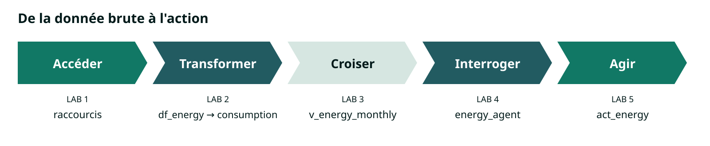
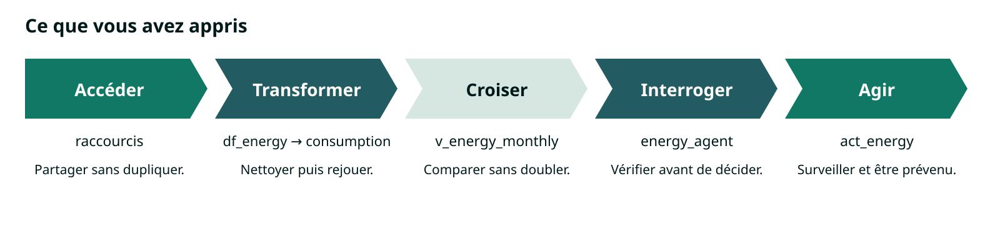

# Product Hands-on Lab - Microsoft Fabric de bout en bout

Bienvenue ! Dans cet atelier, vous allez construire de bout en bout une chaîne de données dans Microsoft Fabric : partir d'un fichier brut, en faire une table fiable, l'interroger en langage naturel et recevoir une alerte quand un seuil est franchi. Le tout sans écrire une ligne de code dans le parcours principal.

Que vous travailliez dans l'analyse métier, la gestion de projet, le contrôle de gestion ou la RSE, cet atelier vous invite à découvrir ce que Fabric change concrètement dans votre travail quotidien avec la donnée. Vous avancerez pas à pas, avec les mêmes données et un résultat à vérifier à chaque lab.

## Ce que vous allez apprendre

À la fin de l'atelier, vous saurez :

- **accéder** à des données sans les copier, grâce aux raccourcis OneLake ;
- **transformer** un fichier imparfait en table fiable, avec un outil visuel ;
- **croiser et agréger** des données en quelques clics, sans SQL à écrire ;
- **interroger** vos données en langage naturel avec un data agent, et vérifier ses réponses ;
- **agir** en recevant une notification Teams lorsqu'un seuil est dépassé.

Les labs optionnels vont plus loin : entrepôt T-SQL, modèle sémantique Direct Lake, temps réel. Copilot est proposé en bonus.

## Ce que vous allez construire

Vous travaillez pour Contoso, une entreprise fictive qui possède des bureaux, des entrepôts, des usines et des agences. Ses équipes veulent comparer la consommation énergétique et l'empreinte carbone de leurs bâtiments, et surtout être prévenues quand la consommation dérive.

Vous partirez des relevés de l'année 2025, un fichier avec ses trous et ses erreurs, comme dans la vraie vie. Vous en ferez une table propre, vous la croiserez avec le référentiel des sites et les facteurs d'émission, puis vous poserez vos questions à un agent conversationnel. Enfin, vous définirez une alerte sur le rapport de consommation du dernier jour disponible. Quand la Bretagne franchira le seuil, c'est vous qui recevrez le message.

Ce que vous aurez compris en sortant : la chaîne complète, de la donnée brute à l'action. Vous pourrez la rejouer sur vos propres données, avec vos contrôles et vos autorisations.

Les données sont synthétiques et les facteurs carbone fictifs : les résultats ne constituent pas un reporting réel.



## Durée et rythme

L'atelier dure **3 heures** : cinq labs de 15 à 35 minutes, une pause de 15 minutes après le Lab 2, et du temps pour les questions. Les Labs 6 à 8 sont optionnels : ils approfondissent l'entrepôt T-SQL, le modèle sémantique Direct Lake et le temps réel, pour ceux qui veulent aller plus loin ou pour une journée d'upskilling. Copilot est proposé en bonus.

## Architecture


[Agrandir le schéma d'architecture](assets/00-architecture.svg).

Les tables de référence de `lh_source` sont vues depuis votre lakehouse `lh_lab` par des raccourcis, sans copie. Le fichier public alimente votre flux `df_energy`, qui produit la table `consumption`, que vous explorez et que votre agent `energy_agent` interroge. De son côté, le rapport commun `energy_report` porte votre alerte `act_energy`, qui vous notifie dans Teams.

## Prérequis

- Un compte professionnel de votre organisation.
- Le rôle **Membre** sur votre workspace `$$lab_ws:ws-lab-<votre identifiant>$$`, rattaché à une capacité Fabric payante **F2 ou supérieure**, avec les fonctionnalités du lab activées.
- L'accès en lecture au workspace commun `$$shared_ws:ws-shared$$`, où le rapport et les sources vous attendent.
- Un navigateur récent, Fabric affiché en français.
- Teams, pour l'entraide dans le canal $$teams_channel:de l'atelier$$ et pour recevoir votre alerte.

Deux conventions pour la route : dans les Labs 1 à 5, une étape regroupe les actions d'un même écran ; à chaque point de contrôle, vérifiez que vous voyez la même chose que nous avant de continuer.

## Auteur

**[Amine Lemsih](https://github.com/AmineLemsih)**  
Cloud Solution Architect Data & AI, Microsoft.

<details>
<summary>Contexte (optionnel) : glossaire et unités</summary>

Un **workspace**, ou espace de travail, regroupe les éléments Fabric et leurs droits d'accès. Une **capacité** est la ressource de calcul partagée par ces éléments. Un **tenant** est l'environnement de votre organisation.

**OneLake** est le stockage logique commun de Fabric. Un **lakehouse** organise des fichiers et des tables dans OneLake. Une **table Delta** est un ensemble de fichiers de données avec un journal assurant la cohérence des écritures.

Dans `lh_source`, la table `sites` (sites) décrit les bâtiments. La table `emission_factors` (facteurs d'émission) fournit deux coefficients par année. Vous créerez dans `lh_lab` la table `consumption` (consommation). La table `consumption_latest_day` (consommation du dernier jour disponible) est déjà préparée dans la source pour le rapport.

Un **raccourci OneLake** référence une table existante sans en créer une copie indépendante. **Dataflow Gen2** nettoie les données par des actions visuelles. Un **pipeline** enchaîne et planifie des activités. Un **data agent** transforme une question en requête sur les données autorisées. **Activator** surveille une condition et lance une action.

**SSO**, ou authentification unique, signifie que le moteur utilise votre identité. Une **identité fixe** utilise celle d'une connexion autorisée, comme pour le modèle du rapport commun.

Les identifiants techniques restent en anglais, même si le texte est français. Les lakehouses, warehouses, tables et colonnes utilisent des lettres, chiffres et underscores. Les tirets de `ws-lab-...` concernent le workspace.

Un **kWh** mesure une quantité d'énergie. Un **kW** mesure une puissance. Un **kgCO2e** exprime une masse de gaz à effet de serre ramenée à un équivalent CO2. Multiplier les kWh par un facteur en kgCO2e/kWh donne une estimation en kgCO2e.

Le fichier annuel couvre l'année civile 2025. Le « dernier jour disponible » est le 31 décembre 2025, pas aujourd'hui. Les deux énergies sont additionnables en kWh, mais elles n'ont pas le même facteur carbone. Les lignes supprimées au nettoyage sont des observations manquantes, pas des consommations égales à zéro.

</details>

---

## Lab 1 · Prise en main

**Pourquoi c'est important pour Contoso**

Vous allez travailler avec les mêmes bâtiments et les mêmes facteurs d'émission que les autres équipes de Contoso. Grâce aux raccourcis, vous pourrez lire ces références dans votre espace sans entretenir une copie de plus.

**Objectif :** créer votre lakehouse et accéder aux deux tables de référence sans les copier.

**Durée : 20 min.**

### Créer votre lakehouse

Tout ce que vous construirez pendant l'atelier vivra dans votre workspace `$$lab_ws:ws-lab-<votre identifiant>$$`. Vous commencez par y créer un lakehouse : c'est l'endroit où vos tables et vos fichiers seront stockés dans OneLake.

1. Ouvrez <a href="https&#58;//app.fabric.microsoft.com/" target="_blank" rel="noopener noreferrer">Microsoft Fabric</a> et connectez-vous avec votre compte professionnel.

  *[capture : accueil Fabric après connexion, compte masqué]*

2. Dans le menu de gauche, sélectionnez **Espaces de travail**, puis ouvrez `$$lab_ws:ws-lab-<votre identifiant>$$`.

  *[capture : votre workspace et la commande Nouvel élément]*

3. Sélectionnez **Nouvel élément**, recherchez **Lakehouse** et sélectionnez-le.

  *[capture : sélecteur d'éléments avec Lakehouse]*

4. Nommez-le `lh_lab`, laissez **Schémas de lakehouse** activé, puis sélectionnez **Créer**. <!-- TODO vérifier -->

  *[capture : dialogue de création de lh_lab, schémas activés]*

Le lakehouse s'ouvre sur son explorateur : une zone **Tables**, pour les données structurées, et une zone **Fichiers**, pour tout le reste. Les deux sont vides pour l'instant.

*[capture : lakehouse lh_lab vide, avec Tables et Fichiers]*

### Créer les raccourcis vers les références

Les tables `sites` et `emission_factors` existent déjà dans le lakehouse commun `lh_source`. Plutôt que de les copier, vous allez créer deux raccourcis OneLake : elles apparaîtront dans `lh_lab`, mais la donnée restera dans `lh_source`, maintenue à un seul endroit.

1. Dans `lh_lab`, ouvrez le menu **…** du schéma `dbo` sous **Tables**, puis sélectionnez **Nouveau raccourci**. <!-- TODO vérifier -->

  *[capture : menu de dbo et commande Nouveau raccourci]*

2. Choisissez **Microsoft OneLake** comme source, puis le workspace `$$shared_ws:ws-shared$$` et le lakehouse `lh_source`. Sélectionnez **Suivant**.

  *[capture : catalogue OneLake avec lh_source sélectionné]*

3. Développez les tables du schéma `dbo`, cochez `sites` et `emission_factors`, puis sélectionnez **Suivant**.

  *[capture : assistant de raccourci avec les deux tables cochées]*

4. Gardez les noms `sites` et `emission_factors` dans le résumé, puis sélectionnez **Créer**.

  *[capture : résumé des deux raccourcis avant création]*

Si l'assistant n'accepte qu'une table à la fois, créez `sites`, puis recommencez pour `emission_factors`.

<div class="task" data-title="Point de contrôle">

> Sous **Tables** de `lh_lab`, `sites` et `emission_factors` apparaissent avec l'icône de raccourci. Ouvrez `sites` : l'aperçu montre **30 lignes**, avec les colonnes `site_id`, `region` et `opening_date`. Ouvrez `emission_factors` : **une seule ligne**, l'année **2025** et les coefficients **0,055** et **0,205**. Dans les **Propriétés** d'un raccourci, la cible reste `lh_source` dans `$$shared_ws:ws-shared$$`. Aucune copie n'a été lancée : vous lisez la donnée là où elle est. <!-- TODO vérifier -->

</div>

*[capture : aperçu de sites, 30 lignes et colonnes de référence]*

*[capture : aperçu de emission_factors, année et deux coefficients]*

*[capture : propriétés du raccourci, cible lh_source sans identifiant privé]*

### Variante : lire une source S3 (10 min, si disponible)

Un raccourci fonctionne aussi vers un stockage externe. Si le raccourci `$$s3_shortcut:s3_demo$$` est disponible sous **Fichiers** de `lh_source`, vous pouvez le lire depuis votre lakehouse de la même façon. Cette variante reste hors des 3 heures ; sa disponibilité est annoncée dans le canal Teams $$teams_channel:de l'atelier$$.

1. Dans `lh_lab`, ouvrez le menu **…** de **Fichiers**, puis **Nouveau raccourci** et **Microsoft OneLake**.

  *[capture : nouveau raccourci OneLake sous Fichiers]*

2. Sélectionnez `$$shared_ws:ws-shared$$`, puis `lh_source` et, sous **Fichiers**, `$$s3_shortcut:s3_demo$$`. Sélectionnez **Suivant**, gardez le nom proposé et sélectionnez **Créer**. <!-- TODO vérifier -->

  *[capture : cible s3_demo sous Fichiers dans lh_source]*

3. Ouvrez `$$s3_shortcut:s3_demo$$` dans `lh_lab` et parcourez les fichiers.

  *[capture : fichiers S3 accessibles depuis le raccourci dans lh_lab]*

<div class="task" data-title="Point de contrôle de la variante">

> Dans **Fichiers** de `lh_lab`, vous retrouvez les mêmes fichiers de démonstration que sous `$$s3_shortcut:s3_demo$$` dans `lh_source`. Ils restent dans le bucket Amazon S3 : vous les lisez depuis Fabric sans les avoir déplacés, par un raccourci vers un raccourci.

</div>

### Si ça bloque

Avant de recréer un élément, situez le blocage : trouver la source, lire sa donnée ou choisir le bon emplacement.

- **`ws-shared` ou `lh_source` invisible :** vérifiez votre compte professionnel, l'organisation de l'atelier et le workspace `$$shared_ws:ws-shared$$`.
- **Table visible mais données refusées :** notez le message exact et transmettez-le dans le canal Teams $$teams_channel:de l'atelier$$ ; les droits de lecture sur `lh_source` et leur propagation sont à contrôler.
- **`dbo` introuvable :** cherchez-le sous **Tables**, pas sous **Fichiers** ; si le lakehouse source est sans schémas, utilisez directement son dossier **Tables** dans l'assistant.

<details>
<summary>Contexte (optionnel) : partager une référence, pas une copie (5 min)</summary>

Un raccourci stocke une référence vers la table source. Quand vous l'interrogez, le moteur lit la donnée à la cible, avec vos droits. Il n'y a pas de seconde table métier à tenir à jour ; les moteurs peuvent toutefois mettre les fichiers en cache.

C'est le mécanisme à utiliser pour un référentiel partagé : la même table de sites pour toutes les équipes, mise à jour à un seul endroit. Il ne remplace ni une sauvegarde ni un transfert de propriété : si la source est supprimée ou si son propriétaire retire le droit de lecture, le raccourci ne peut plus la lire. Être Membre de votre workspace ne vous donne aucun droit d'écriture sur `lh_source`.

</details>

---

## Lab 2 · Ingestion

**Pourquoi c'est important pour Contoso**

Vous allez rendre les relevés de Contoso exploitables malgré leurs trous et leurs erreurs. En enregistrant votre nettoyage dans un flux visuel, vous pourrez le rejouer sur le fichier sans refaire les corrections à la main.

**Objectif :** alimenter `consumption` avec un flux visuel et l'exécuter depuis un pipeline.

**Durée : 35 min.** Une pause de 15 min suit ce lab.

### Créer le flux

Vous allez enregistrer votre préparation dans `df_energy` pour pouvoir la rejouer. Son éditeur, Power Query, vous permet de transformer les données visuellement ; vous réglez d'abord la locale pour lire correctement les points décimaux du fichier.

1. Dans votre workspace `$$lab_ws:ws-lab-<votre identifiant>$$`, sélectionnez **Nouvel élément**, recherchez **Dataflow Gen2** et sélectionnez-le.

  *[capture : sélecteur d'éléments avec Dataflow Gen2]*

2. Nommez le flux `df_energy` dans le champ de nom proposé. <!-- TODO vérifier -->

  *[capture : éditeur Power Query et nom df_energy]*

3. Dans **Options**, réglez les **Paramètres régionaux du dataflow** sur **Anglais (États-Unis)**, puis revenez à **Obtenir des données**. <!-- TODO vérifier -->

  *[capture : paramètres régionaux du dataflow, Anglais (États-Unis)]*

### Importer le fichier du dépôt

Vous allez lire les relevés directement depuis le dépôt public, sans télécharger ni déposer de fichier dans Fabric. L'accès est anonyme : cette connexion ne demande pas vos identifiants GitHub.

1. Dans **Obtenir des données**, recherchez et sélectionnez **Web**, ou **Texte/CSV** avec saisie d'URL selon l'interface. <!-- TODO vérifier -->

  *[capture : connecteur Web ou Texte/CSV acceptant une URL]*

2. Collez `https://raw.githubusercontent.com/AmineLemsih/hands-on-lab-microsoft-fabric-end-to-end/main/data/csv/consumption_2025.csv`, choisissez **Anonyme**, puis **Suivant** ou **Se connecter**. <!-- TODO vérifier -->

  *[capture : connexion à l'URL raw et authentification Anonyme]*

3. Dans l'aperçu, choisissez **Texte/CSV** si demandé, la **virgule** comme séparateur et **UTF-8** comme encodage, puis **Transformer les données**. <!-- TODO vérifier -->

  *[capture : aperçu CSV, séparateur virgule et encodage UTF-8]*

Le fichier reste [disponible en téléchargement](https://raw.githubusercontent.com/AmineLemsih/hands-on-lab-microsoft-fabric-end-to-end/main/data/csv/consumption_2025.csv) pour consultation. Pour le lab, passez directement à **Nettoyer et typer** ; n'ajoutez pas aussi la source SharePoint.

### Variante : avec vos propres fichiers

Vous pouvez remplacer la source Web par un fichier SharePoint autorisé, avec le même schéma. Les chiffres de contrôle de cet atelier restent ceux du jeu Contoso : avec d'autres données, il faut les recalculer.

1. Dans **Obtenir des données**, choisissez **Dossier SharePoint**. Saisissez $$sp_site:l'URL de votre site SharePoint$$, pas le lien de partage du fichier, puis choisissez **Compte d'organisation**, **Se connecter** si nécessaire et **Suivant**.

  *[capture : connexion Dossier SharePoint, compte et URL masqués]*

2. Dans la liste des fichiers, filtrez `Name` sur `consumption_2025.csv` et `Folder Path` sur le dossier contenant votre fichier pour ne garder qu'une ligne.

  *[capture : liste SharePoint filtrée sur Name et Folder Path]*

3. Ouvrez la valeur binaire de `Content`, choisissez la **virgule** et **UTF-8**, puis ouvrez l'éditeur de transformation. <!-- TODO vérifier -->

  *[capture : contenu CSV du fichier SharePoint dans Power Query]*

### Nettoyer et typer

Vous allez retirer les observations inutilisables, puis préparer une date de début de mois pour comparer les consommations. Les six colonnes de départ sont `site_id`, `date`, `year`, `kwh_elec`, `kwh_gas` et `avg_temp`.

1. Dans Power Query, renommez la requête `consumption`. Si les noms des colonnes sont encore sur la première ligne, appliquez **Utiliser la première ligne pour les en-têtes** ; puis choisissez **Accueil > Supprimer les lignes > Supprimer les lignes vides**.

  *[capture : requête consumption, en-têtes et suppression des lignes vides]*

2. Avec l'icône de type des colonnes, corrigez uniquement les types incorrects : `site_id` en **Texte**, `date` en **Date**, `year` en **Nombre entier**, et les trois autres en **Nombre décimal**. La valeur `invalid` peut notamment laisser `kwh_elec` en Texte : convertissez-la avant la suite. <!-- TODO vérifier -->

  *[capture : types des six colonnes et erreurs révélées par la conversion]*

3. Sélectionnez les six colonnes, puis **Supprimer les lignes > Supprimer les erreurs**.

  *[capture : étapes appliquées, suppression des vides puis des erreurs]*

4. Sélectionnez `date`, puis **Ajouter une colonne > Date > Mois > Début du mois**. Nommez la nouvelle colonne `month_start` et utilisez le type **Date**. <!-- TODO vérifier -->

  *[capture : colonne month_start et valeurs au premier jour du mois]*


<div class="important" data-title="Une erreur n'est pas une consommation nulle">

> Le fichier contient 55 enregistrements vides et 55 valeurs `invalid`. Ne remplacez pas ces erreurs par zéro. Les 110 observations sont exclues de l'analyse. Les lignes à zéro avant l'ouverture d'un site sont valides et restent présentes. L'aperçu Power Query peut être limité : ne confondez pas son nombre de lignes avec le volume complet.

</div>

### Écrire dans le lakehouse

Votre préparation est prête ; vous allez écrire son résultat dans `lh_lab`. La méthode **Remplacer** permettra de rejouer le flux sans ajouter une deuxième copie des observations.

1. Sur la requête `consumption`, choisissez **Ajouter une destination de données > Lakehouse**.

  *[capture : choix de la destination Lakehouse]*

2. Dans le sélecteur, choisissez votre workspace, `lh_lab`, le schéma `dbo`, puis une **Nouvelle table** nommée `consumption`.

  *[capture : destination lh_lab.dbo.consumption]*

3. Dans les paramètres de destination, choisissez **Remplacer** et conservez la correspondance des sept colonnes vers les colonnes de même nom, puis validez. <!-- TODO vérifier -->

  *[capture : correspondance des sept colonnes et méthode Remplacer]*

4. Dans l'éditeur, choisissez **Publier** ou **Enregistrer et exécuter** selon l'interface. Si la publication n'a pas lancé d'exécution, lancez le flux depuis le workspace. <!-- TODO vérifier -->

  *[capture : publication du flux et lancement de son exécution]*

<div class="task" data-title="Point de contrôle avant le pipeline">

> Dans l'**historique d'actualisation** de `df_energy`, attendez la réussite, puis ouvrez les **détails de l'exécution** : la destination doit avoir reçu **10 840 lignes**. <!-- TODO vérifier --> Dans `lh_lab`, actualisez **Tables > dbo**, puis ouvrez `consumption` : vous retrouvez les sept colonnes, dont `month_start` de type Date au premier jour du mois. L'aperçu peut être limité ; le volume complet se contrôle dans les détails d'exécution, pas en comptant ses lignes visibles.

</div>

*[capture : historique réussi du dataflow et 10 840 lignes écrites]*

*[capture : aperçu de consumption dans le lakehouse avec les sept colonnes]*

### Orchestrer et exécuter

Vous allez relancer la même préparation depuis un pipeline, `pl_energy_daily`. C'est lui qui organise les exécutions ; le nettoyage reste dans `df_energy`.

1. Depuis votre workspace, choisissez **Nouvel élément > Pipeline de données**, nommez-le `pl_energy_daily`, puis sélectionnez **Créer**.

  *[capture : création du pipeline pl_energy_daily]*

2. Sur le canevas du pipeline, ouvrez **Activités** et ajoutez une activité **Dataflow**.

  *[capture : canevas avec une activité Dataflow]*

3. Sélectionnez l'activité ; dans ses **Paramètres**, choisissez votre workspace et le flux `df_energy`.

  *[capture : paramètres de l'activité pointant vers df_energy]*

4. Enregistrez le pipeline, puis sélectionnez **Exécuter**.

  *[capture : lancement manuel du pipeline]*

<div class="task" data-title="Point de contrôle">

> Dans la sortie d'exécution du pipeline, l'activité **Dataflow** doit être réussie. Retrouvez aussi cette nouvelle exécution dans l'historique de `df_energy` : ses détails indiquent toujours **10 840 lignes** écrites dans `lh_lab.dbo.consumption`. La destination est restée en **Remplacer** et la table garde ses **sept colonnes** : vous avez rejoué le nettoyage sans cumuler les chargements.

</div>

*[capture : pipeline réussi et détails de la nouvelle exécution du dataflow]*

### Si ça bloque

Commencez par l'écran où l'exécution s'arrête : la connexion, la conversion ou la destination. Cela évite de refaire tout le flux pour un seul réglage.

- **Fichier refusé ou import multiple :** vérifiez l'URL raw et l'accès anonyme ; pour SharePoint, contrôlez `Name` et `Folder Path`.
- **Décimaux ou dates en erreur :** vérifiez la locale de conversion et l'ordre des étapes.
- **Échec de destination ou doublons :** vérifiez votre workspace, `lh_lab` et la méthode **Remplacer** ; transmettez le message dans le canal Teams $$teams_channel:de l'atelier$$ si l'erreur persiste.

<details>
<summary>Contexte (optionnel) : préparer les données et organiser le travail (5 min)</summary>

Dataflow Gen2 mémorise des transformations Power Query. À l'exécution, il relit la source et écrit le résultat. Le pipeline orchestre cette exécution ; il ne corrige pas lui-même le fichier.

Utilisez un flux pour des préparations récurrentes accessibles aux analystes. Utilisez un pipeline pour organiser plusieurs activités et leur calendrier. Le mode « Remplacer » convient au petit historique complet du lab. En production, il faut traiter les mises à jour incrémentales, les rejets, les responsabilités et le suivi des coûts. Une donnée absente n'est pas réparée par une planification.

Pour une exécution automatique facultative, ouvrez **Planifier** et choisissez **Quotidienne**. <!-- TODO vérifier --> Définissez l'heure, le fuseau et une date de fin adaptés à votre besoin, puis enregistrez la planification ; ne l'activez que si vous souhaitez réellement ces exécutions.

</details>

<div class="info" data-title="Pause : 15 minutes">

> Faites une pause de 15 minutes. Laissez les éléments ouverts ; ne supprimez rien.

</div>

---

## Lab 3 · Exploration

**Pourquoi c'est important pour Contoso**

Vous allez passer des relevés de chaque bâtiment à une comparaison des régions mois par mois. En rapprochant les consommations des références de Contoso, vous pourrez voir où se concentre l'énergie consommée, sans compter deux fois la même observation.

**Objectif :** produire une vue des consommations électriques et de gaz par région et par mois, sans écrire de requête.

**Durée : 25 min.**

### Ouvrir la requête visuelle

Vous allez lire vos tables depuis le point de terminaison SQL du lakehouse, puis construire l'analyse sur un canevas visuel. Vous utiliserez les tables déjà créées, sans écrire de SQL ni recopier les données.

1. Dans `lh_lab`, choisissez **Analyser les données avec > Point de terminaison d'analytique SQL**, puis actualisez l'explorateur. <!-- TODO vérifier -->

  *[capture : point de terminaison SQL, tables consumption, sites et emission_factors]*

2. Sélectionnez **Nouvelle requête visuelle**, nommez-la `q_energy_monthly`, puis faites glisser `consumption`, `sites` et `emission_factors` sur le canevas.

  *[capture : requête q_energy_monthly avec les trois tables sur le canevas]*

### Rapprocher les tables

Vous allez donner une région à chaque relevé, puis lui associer les facteurs de son année. Les jointures **Externes gauches** conservent les observations de `consumption`, même si une référence manque : une valeur vide pourra ainsi révéler le problème.

1. Dans le menu du bloc `consumption`, choisissez **Fusionner les requêtes**. Dans le dialogue, sélectionnez `sites` comme seconde table, `site_id` dans les deux tables et **Externe gauche**, puis validez. <!-- TODO vérifier -->

  *[capture : fusion avec sites, clé site_id et jointure Externe gauche]*

2. Sur la colonne issue de `sites`, ouvrez le bouton de développement, gardez seulement `region`, décochez l'option de préfixe du nom de colonne et validez. <!-- TODO vérifier -->

  *[capture : développement de region sans préfixe]*

3. Dans le menu du résultat fusionné, choisissez **Fusionner les requêtes**. Sélectionnez `emission_factors`, la clé `year` dans les deux tables et **Externe gauche**, puis validez.

  *[capture : fusion avec emission_factors sur year]*

4. Développez la colonne issue de `emission_factors`, gardez `elec_kgco2e_per_kwh` et `gas_kgco2e_per_kwh`, décochez le préfixe et validez.

  *[capture : développement des deux coefficients sans préfixe]*

La table des facteurs possède **une seule ligne par année**, avec deux colonnes de coefficients. Chaque observation doit rester une seule observation après la jointure ; transformer les deux énergies en deux lignes changerait ce résultat.

### Regrouper les consommations

Vous allez passer du détail site/jour à une ligne par région et par mois. Vous garderez les deux énergies séparées et compterez les observations : ce nombre vous servira à détecter un doublon introduit par une jointure.

1. Dans **Regrouper par**, choisissez **Avancé** et les clés `region` puis `month_start`. Ajoutez `total_kwh_elec` avec **Somme** sur `kwh_elec`, `total_kwh_gas` avec **Somme** sur `kwh_gas`, puis `observation_count` avec **Nombre de lignes** ; validez.

  *[capture : dialogue Regrouper par, deux clés et trois agrégations]*

### Enregistrer la vue

Vous allez conserver cette analyse sous le nom `v_energy_monthly` pour la retrouver sans reconstruire le canevas. La vue enregistre la définition de votre lecture, pas une nouvelle copie des résultats.

1. Sélectionnez la dernière étape du résultat agrégé, activez **Activer le chargement** si nécessaire dans son menu, puis choisissez **Enregistrer comme vue**. <!-- TODO vérifier -->

  *[capture : menu du résultat final, chargement actif et Enregistrer comme vue]*

2. Dans le dialogue, choisissez le schéma `dbo`, saisissez `v_energy_monthly` et confirmez l'enregistrement.

  *[capture : enregistrement de dbo.v_energy_monthly]*

<div class="task" data-title="Point de contrôle">

> Dans l'explorateur du **point de terminaison SQL** de `lh_lab`, actualisez la liste des vues et ouvrez `dbo.v_energy_monthly`. Le résultat doit contenir **72 couples région/mois** et les colonnes `total_kwh_elec`, `total_kwh_gas` et `observation_count`. La somme des `observation_count` doit être **10 840**, pas le double. Sur le canevas de `q_energy_monthly`, revenez au résultat des jointures pour contrôler `region` et les deux coefficients : ils ne doivent pas être vides pour les données Contoso. L'ordre d'affichage des lignes de la vue n'est pas garanti. <!-- TODO vérifier -->

</div>

*[capture : résultat des jointures avec region et les deux coefficients]*

*[capture : résultat regroupé avec les 72 couples région/mois]*

*[capture : vue v_energy_monthly ouverte depuis l'explorateur SQL]*

### Si ça bloque

Un résultat inattendu vient souvent d'une clé ou du mauvais bloc sélectionné. Revenez à l'étape concernée du canevas, sans refaire toute l'analyse.

- **Table absente en SQL :** vérifiez la table ou le raccourci dans le lakehouse, puis actualisez l'explorateur après la synchronisation.
- **Totaux doublés ou facteurs vides :** vérifiez les clés `site_id` et `year`, leurs types et l'unicité de `emission_factors.year`.
- **Vue impossible à enregistrer :** sélectionnez le résultat regroupé et transmettez le message avec le nom de l'étape concernée dans le canal Teams $$teams_channel:de l'atelier$$.

<details>
<summary>Contexte (optionnel) : variante T-SQL, hors parcours principal sans code</summary>

Sur le **point de terminaison SQL** de `lh_lab`, ouvrez une nouvelle requête SQL. La variante utilise les mêmes tables et la même définition métier. Le schéma est `dbo`.

```sql
-- Créer ou remplacer la définition, sans copier les résultats.
CREATE OR ALTER VIEW dbo.v_energy_monthly AS
SELECT
    sites.region,
    consumption.month_start,
    COUNT_BIG(*) AS observation_count,
    SUM(consumption.kwh_elec + consumption.kwh_gas) AS total_kwh,
    SUM(consumption.kwh_elec * factors.elec_kgco2e_per_kwh
      + consumption.kwh_gas * factors.gas_kgco2e_per_kwh) AS kgco2e
FROM dbo.consumption AS consumption
LEFT JOIN dbo.sites AS sites
    ON sites.site_id = consumption.site_id
LEFT JOIN dbo.emission_factors AS factors
    ON factors.[year] = consumption.[year]
GROUP BY sites.region, consumption.month_start;
```

Exécutez cette seconde requête séparément :

```sql
-- Le tri est une propriété de la lecture, pas de la vue.
SELECT region, month_start, observation_count,
       ROUND(total_kwh, 2) AS total_kwh,
       ROUND(kgco2e, 2) AS kgco2e
FROM dbo.v_energy_monthly
ORDER BY kgco2e DESC, region, month_start;
```

</details>

<details>
<summary>Contexte (optionnel) : une même donnée, plusieurs lectures (5 min)</summary>

Le point de terminaison SQL lit les tables Delta. Il peut conserver une définition de vue, mais ne permet pas d'écrire les relevés comme un warehouse. Le lakehouse et la vue ne sont donc pas deux bases contenant deux copies des consommations.

La vue visuelle conserve séparément les kWh électriques et de gaz. Le calcul en kgCO2e reste dans la variante T-SQL repliée, les instructions de l'agent du Lab 4 et la mesure DAX du Lab 7. Exécuter la variante T-SQL remplace `v_energy_monthly` par sa version avec calcul carbone : choisissez une variante, pas deux définitions à cumuler.

Utilisez la vue pour une logique de lecture partagée. Le calcul carbone dépend de la validité des clés et des coefficients. Le moteur ne sait pas qu'une jointure a doublé vos résultats. Une vue agrégée perd aussi le détail : le data agent doit conserver l'accès aux tables pour retrouver un jour anormal.

</details>

---

## Lab 4 · Data agent

**Pourquoi c'est important pour Contoso**

Vous allez poser vos questions avec vos propres mots, comme le feraient les équipes de Contoso. Vous apprendrez aussi à vérifier ce que l'agent a compris : une réponse convaincante ne suffit pas pour prendre une décision.

**Objectif :** améliorer et vérifier les réponses de `energy_agent` à six questions métier.

**Durée : 30 min.**

### Créer l'agent

Vous allez donner à `energy_agent` accès aux trois tables de votre lakehouse, pas à toutes les données du workspace. Ce périmètre lui permettra de répondre aux questions de Contoso et de retrouver le détail d'un site ou d'un jour.

1. Dans votre workspace, choisissez **Nouvel élément**, recherchez **Agent de données Fabric** et sélectionnez-le. <!-- TODO vérifier -->

  *[capture : sélecteur d'éléments avec Agent de données Fabric]*

2. Dans le dialogue de création, nommez l'agent `energy_agent`, puis sélectionnez **Créer**.

  *[capture : création de energy_agent]*

3. Dans le catalogue des sources, choisissez `lh_lab`, puis **Ajouter**.

  *[capture : catalogue des sources, lh_lab sélectionné]*

4. Dans l'explorateur de l'agent, cochez seulement `consumption`, `sites` et `emission_factors` ; décochez les autres tables ou vues proposées.

  *[capture : les trois tables sélectionnées pour l'agent]*

### Poser les six questions avant configuration

Vous allez d'abord voir ce que l'agent comprend sans vos définitions métier. Gardez cette première série de réponses : elle servira de point de comparaison, y compris si certaines réponses sont incorrectes.

1. Dans la conversation, posez Q1, puis Q2 à Q6 dans l'ordre, en appliquant le contrôle ci-dessous après chaque réponse.

  *[capture : conversation et première réponse à Q1 avant configuration]*

| Question | Texte à poser |
| --- | --- |
| Q1 | Quelle est la consommation électrique totale observée en 2025, en kWh ? |
| Q2 | Quelle région émet le plus de kgCO2e en 2025, électricité et gaz réunis ? |
| Q3 | Quel mois de 2025 a la consommation totale la plus élevée, en kWh ? |
| Q4 | Quels couples site et jour dépassent 20 000 kWh, électricité et gaz réunis, en 2025 ? |
| Q5 | Combien de sites étaient actifs au 1er janvier 2025 ? |
| Q6 | De quel pourcentage nos émissions ont-elles baissé entre 2024 et 2025 ? |

<div class="task" data-title="Point de contrôle avant configuration">

> Dans les **étapes de chaque réponse**, développez la source choisie et la requête générée, sans la modifier. <!-- TODO vérifier --> Notez le résultat, la période et l'unité dans vos notes personnelles. Pour Q2, cherchez l'usage des deux facteurs ; pour Q4, le seuil de **20 000 kWh par site et jour**, pas par région ; pour Q6, la reconnaissance de l'absence de **2024**. Une règle ignorée ou une réponse inventée se note comme un écart à comparer après configuration.

</div>

*[capture : détails d'une réponse, source et requête générée]*

*[capture : réponse à Q6 avant configuration, absence de données 2024]*

### Ajouter les définitions métier

Vous allez préciser ce que signifient une consommation, un site actif et un calcul carbone pour Contoso. Ces instructions donnent des repères à l'agent ; elles ne dispensent pas de vérifier ses réponses.

1. Ouvrez **Instructions de l'agent de données**, collez le texte ci-dessous, puis enregistrez. <!-- TODO vérifier -->

  *[capture : instructions françaises enregistrées dans l'agent]*

> Répondez en français. Utilisez uniquement les tables sélectionnées de lh_lab. Indiquez la période, l'unité, les tables et les limites des résultats.
>
> Les consommations kwh_elec et kwh_gas sont des énergies journalières en kWh, pas des puissances. La consommation totale est leur somme. L'année est l'année civile, du 1er janvier inclus au 1er janvier suivant exclu. Pour ce jeu, seule 2025 est disponible.
>
> Un site est actif à une date si opening_date est antérieure ou égale à cette date. Aucune fermeture n'est modélisée. Comptez les sites depuis sites, sans compter plusieurs fois les relevés quotidiens. Ne confondez pas site actif et consommation non nulle.
>
> Reliez consumption.site_id à sites.site_id. Reliez consumption.year à emission_factors.year, unique par année. Utilisez elec_kgco2e_per_kwh pour l'électricité et gas_kgco2e_per_kwh pour le gaz. Additionnez les deux contributions en kgCO2e. Arrondissez après la somme. Les facteurs sont fictifs, ne pas utiliser pour un reporting réel.
>
> Les 110 observations rejetées au nettoyage sont absentes. Les totaux portent sur les observations conservées ; n'inventez pas leurs valeurs. Les six pics sont présents dans les données nettoyées. Pour une anomalie journalière, comparez la somme des deux énergies au seuil par couple site/date.
>
> Si une période ou une information manque, dites-le et demandez les données nécessaires. N'inventez pas de résultat pour 2024, de pourcentage de baisse, de cause de panne ou de facteur d'émission externe.

### Ajouter un exemple sans écrire de code

Vous allez montrer à l'agent comment répondre à Q1 en lui associant une requête de référence. Le fichier est fourni : vous le copiez, sans écrire de code.

1. Ouvrez le [fichier d'exemple Q1](assets/q1-example.sql) et copiez la requête complète.

  *[capture : fichier SQL de référence ouvert et copiable]*

2. Dans **Exemples de requêtes**, sélectionnez la source `lh_lab`, puis **Ajouter un exemple**. <!-- TODO vérifier -->

  *[capture : catalogue des exemples, source lh_lab]*

3. Dans l'éditeur, saisissez le texte de Q1 comme question, collez la requête dans le champ prévu et lancez la **validation**. Enregistrez seulement si elle réussit ; une requête en erreur ou une réponse textuelle ne doit pas devenir un exemple SQL. <!-- TODO vérifier -->

  *[capture : paire question/requête Q1 et validation réussie]*

### Comparer après configuration

Vous allez reposer les mêmes questions dans une conversation vide pour comparer les résultats sans conserver l'échange précédent. Avant d'effacer, gardez vos six réponses initiales dans vos notes ; le tableau ci-dessous vous aide à comparer les faits, pas seulement la formulation.

1. Dans la conversation de l'agent, sélectionnez **Effacer la conversation**. <!-- TODO vérifier -->

  *[capture : nouvelle conversation après effacement de l'historique]*

2. Reposez Q1 à Q6 dans le même ordre.

  *[capture : réponses après configuration de l'agent]*

| Question | Résultat avant | Résultat après | Période et unité justes ? | Conforme au corrigé ? |
| --- | --- | --- | --- | --- |
| Q1 | À noter | À noter | À noter | À noter |
| Q2 | À noter | À noter | À noter | À noter |
| Q3 | À noter | À noter | À noter | À noter |
| Q4 | À noter | À noter | À noter | À noter |
| Q5 | À noter | À noter | À noter | À noter |
| Q6 | À noter | À noter | À noter | À noter |


<div class="task" data-title="Point de contrôle">

> Dans l'explorateur de `energy_agent`, retrouvez les **trois tables** sélectionnées ; dans sa configuration, les instructions enregistrées et l'exemple Q1 validé. Développez les **étapes des nouvelles réponses** pour comparer sources, requêtes, périodes et unités dans vos notes, puis confrontez les résultats au corrigé partagé dans le canal Teams $$teams_channel:de l'atelier$$. Q4 doit retrouver **six couples site/jour** ; Q5, **27 sites actifs au 1er janvier 2025** ; Q6 doit expliquer que le pourcentage ne peut pas être calculé sans **2024**. Si une erreur persiste, conservez-la dans la comparaison : c'est une limite à traiter, pas à masquer.

</div>

*[capture : détails des réponses après configuration et résultats contrôlés]*

### Si ça bloque

Situez le problème avant de modifier les instructions : disponibilité de l'agent, accès aux données ou interprétation de la question.

- **Élément agent absent :** vérifiez votre workspace, puis signalez l'absence dans le canal Teams $$teams_channel:de l'atelier$$.
- **Source vide ou refusée :** vérifiez les trois tables cochées et leur visibilité dans le point de terminaison SQL.
- **Réponse ou exemple incorrect :** comparez les noms de tables et de colonnes de la requête avec votre source, puis signalez l'écart. <!-- TODO vérifier -->

<details>
<summary>Contexte (optionnel) : guider une réponse, pas garantir la vérité (5 min)</summary>

Le data agent s'appuie sur les schémas, les instructions et les exemples pour produire une requête. Le moteur de données exécute cette requête avec les autorisations applicables. Fabric gère le service d'IA intégré ; vous ne fournissez pas une clé Azure OpenAI dans ce lab.

Utilisez-le pour retrouver des faits et explorer des questions bien définies. Il ne remplace pas un contrôle des résultats, une définition d'indicateur ni une analyse causale. L'exemple aide pour certaines formes de questions ; il ne garantit pas les réponses suivantes. Des données absentes restent absentes, même après une meilleure instruction.

</details>

---

## Lab 5 · Alerte

**Pourquoi c'est important pour Contoso**

Vous n'avez pas à garder le rapport ouvert pour repérer une dérive. Vous allez demander à Fabric de surveiller la consommation régionale de Contoso et de vous prévenir dans Teams quand le seuil est franchi, pour savoir quand examiner la situation.

**Objectif :** enregistrer une alerte personnelle sur le rapport partagé et observer son déclenchement.

**Durée : 15 min.**

### Ouvrir le rapport commun

Vous allez surveiller une consommation déjà présentée dans le rapport partagé, sans le copier. Vous restez lecteur dans l'espace commun ; seule votre alerte sera enregistrée dans votre workspace personnel.

1. Ouvrez $$report_link:le rapport energy_report dans l'espace commun$$.

  *[capture : energy_report ouvert en lecture dans l'espace commun]*

<div class="task" data-title="Point de contrôle avant l'alerte">

> Dans `energy_report`, retrouvez le visuel **consommation du dernier jour disponible par région**. Le dernier jour affiché doit être le **31 décembre 2025** et les six régions doivent être sous **10 000 kWh**. C'est cet état de départ qui permettra ensuite de détecter un franchissement. Si une barre dépasse déjà le seuil, signalez-le dans le canal Teams $$teams_channel:de l'atelier$$ avant de continuer.

</div>

*[capture : visuel régional à l'état initial, six barres sous 10 000 kWh]*

### Définir votre règle

Vous allez demander une notification lorsque la consommation d'une région **devient supérieure à 10 000 kWh**. Le destinataire sera votre propre compte Teams, pas le canal de l'atelier : celui-ci reste réservé à l'entraide.

1. Dans le menu **…** du visuel en barres, choisissez **Définir une alerte** ou **Ajouter une alerte**. <!-- TODO vérifier -->

  *[capture : menu du visuel et commande Définir une alerte]*

2. Dans le volet, réglez la condition sur **Devient > Supérieur à**, avec la valeur `10000`, puis choisissez **Teams** et votre propre compte comme destinataire. <!-- TODO vérifier -->

  *[capture : volet d'alerte, seuil régional et destinataire personnel masqué]*

3. Dans **Sélectionner l'emplacement d'enregistrement**, choisissez `$$lab_ws:ws-lab-<votre identifiant>$$`, puis un nouvel élément Activator nommé `act_energy`, et confirmez l'emplacement. <!-- TODO vérifier -->

  *[capture : dialogue de destination, workspace personnel et act_energy]*

4. De retour dans le volet, sélectionnez **Appliquer** ou **Créer** pour enregistrer la règle. <!-- TODO vérifier -->

  *[capture : volet après enregistrement de la règle]*

<div class="task" data-title="Point de contrôle avant le franchissement">

> Dans le volet d'alerte, contrôlez la mesure **`latest_day_kwh`**, suivie pour chaque **`region`**, la condition **Devient supérieur à 10000** et votre compte Teams. La règle doit être **active**, enregistrée dans `act_energy` dans votre workspace. Ne poursuivez pas avec une règle sur le total de toutes les régions ou une destination dans l'espace commun.

</div>

### Voir le déclenchement et ouvrir Activator

Vous allez suivre un vrai changement de valeur, puis retrouver ce qui a déclenché le message. La bascule des données communes est coordonnée dans le canal Teams : vous ne modifiez pas vous-même la source, et rafraîchir la page du navigateur n'actualise pas le modèle sémantique.

1. Dans le canal Teams $$teams_channel:de l'atelier$$, signalez que votre règle est active. Attendez la confirmation que l'état sous le seuil a été observé, puis l'annonce de la bascule et de l'actualisation du modèle avant le contrôle suivant.

  *[capture : confirmation de la bascule dans le canal de l'atelier, messages anonymisés]*

<div class="task" data-title="Point de contrôle du déclenchement">

> Dans le **rapport actualisé**, la barre de la Bretagne doit maintenant dépasser **10 000 kWh**. Dans vos **notifications personnelles Teams**, retrouvez le message concernant cette région. La règle créée ne suffit pas : c'est la réception du message après ce changement qui confirme le résultat. Si elle tarde, gardez la règle active et signalez le délai dans le canal Teams $$teams_channel:de l'atelier$$ ; ne confondez pas une notification de test avec ce franchissement.

</div>

*[capture : rapport actualisé, Bretagne au-dessus de 10 000 kWh]*

*[capture : notification personnelle Teams correspondant au franchissement]*

2. Depuis le volet d'alerte du rapport, ouvrez le menu de l'élément et choisissez **Ouvrir dans Activator**, puis ouvrez la règle dans `act_energy`. <!-- TODO vérifier -->

  *[capture : règle act_energy ouverte dans Activator]*

<div class="task" data-title="Point de contrôle">

> Dans `act_energy`, retrouvez la **valeur observée**, la **condition**, votre **destinataire** et l'**historique des actions**. <!-- TODO vérifier --> La règle sur `latest_day_kwh` par `region`, au seuil de **10 000 kWh**, doit expliquer le message reçu pour la Bretagne après actualisation. Vous avez relié un changement dans les données à une action traçable, dans votre workspace personnel.

</div>

*[capture : historique réel des actions et condition de la règle régionale]*

### Si ça bloque

Pour trouver où le parcours s'arrête, distinguez le droit de créer la règle, l'actualisation des données et l'envoi du message.

- **Bouton absent ou destination refusée :** vérifiez le workspace personnel choisi, puis transmettez le message dans le canal Teams $$teams_channel:de l'atelier$$.
- **Rapport inchangé :** signalez dans le canal Teams $$teams_channel:de l'atelier$$ que les barres n'ont pas changé et conservez votre règle active.
- **Pas de notification :** vérifiez la règle active, la région, votre destinataire et les deux états observés dans l'historique.

<details>
<summary>Contexte (optionnel) : surveiller un état et déclencher une action (5 min)</summary>

Une règle combine des observations, une condition et une action. « Devient supérieur à » recherche un franchissement, pas simplement une valeur qui reste élevée. Le jeu avant/après crée ce changement de manière contrôlée.

Utilisez une alerte pour inviter à une vérification ou automatiser une réponse autorisée. Sur un rapport, le délai dépend de l'actualisation du modèle et de l'évaluation de la règle. Ce n'est pas la même latence qu'un événement reçu dans un flux. Une notification ne prouve pas une panne et ne doit pas engager une action irréversible sans contrôle adapté.

Le même moteur Activator peut surveiller des flux temps réel et des événements Fabric. Selon la source, les permissions et les actions configurées, il peut envoyer un courriel, appeler un flux Power Automate ou déclencher un élément Fabric tel qu'un pipeline, sans code. Ce lab configure seulement une notification personnelle ; le Lab 8 la compare à une règle sur flux.

</details>

Vous avez terminé le parcours principal : rendez-vous à la Conclusion, ou continuez avec les labs optionnels.

---

## Lab 6 · Extension : entrepôt et T-SQL

**Pourquoi c'est important pour Contoso**

Certaines équipes souhaitent gérer leurs analyses avec des tables et des requêtes SQL.  
Un entrepôt leur fournit une surface d'écriture et de lecture adaptée à cette pratique.

**Objectif :** copier les données propres dans un warehouse et vérifier trois requêtes T-SQL.

**Durée : 30 min, lab optionnel.**

Un **warehouse**, ou entrepôt, est un stockage analytique organisé en tables et piloté par SQL. **T-SQL** est le dialecte SQL utilisé par le warehouse Fabric. À partir de cette extension, des requêtes commentées sont fournies à copier-coller.

### Charger les tables en T-SQL

1. Ouvrez votre workspace personnel.
2. Sélectionnez « Nouvel élément ».
3. Choisissez « Warehouse » ou « Entrepôt ». <!-- TODO vérifier -->
4. Saisissez `wh_energy`.
5. Sélectionnez « Créer ».
6. Ouvrez une « Nouvelle requête SQL » dans `wh_energy`.
7. Collez les trois instructions ci-dessous dans l'éditeur.
8. Sélectionnez uniquement la première instruction, jusqu'au point-virgule.
9. Sélectionnez « Exécuter ».
10. Sélectionnez uniquement la deuxième instruction.
11. Sélectionnez « Exécuter ».
12. Sélectionnez uniquement la troisième instruction.
13. Sélectionnez « Exécuter ».
14. Actualisez l'explorateur du warehouse.
15. Vérifiez la présence de `consumption`, `sites` et `emission_factors` sous `dbo`.

Le nom en trois parties désigne le lakehouse `lh_lab` du même workspace, son schéma `dbo` et sa table. <!-- TODO vérifier -->

```sql
-- Copier l'historique nettoyé dans une nouvelle table du warehouse.
CREATE TABLE dbo.consumption AS
SELECT * FROM lh_lab.dbo.consumption;

-- Copier le référentiel des sites, lu à travers le raccourci du lakehouse.
CREATE TABLE dbo.sites AS
SELECT * FROM lh_lab.dbo.sites;

-- Copier les deux facteurs annuels, sans modifier leur précision.
CREATE TABLE dbo.emission_factors AS
SELECT * FROM lh_lab.dbo.emission_factors;
```

Les types de destination sont déduits de la sélection ; vérifiez les dates et les nombres dans l'explorateur. <!-- TODO vérifier --> Ces instructions créent des tables nouvelles : si une table existe déjà, ne la supprimez pas et passez à son contrôle avant de relancer sa création.

### Exécuter trois requêtes guidées

1. Ouvrez `wh_energy`.
2. Sélectionnez « Nouvelle requête SQL ».
3. Collez la requête 1.
4. Sélectionnez « Exécuter ».
5. Comparez le nombre de lignes et la somme électrique au corrigé.

```sql
-- Requête 1 : contrôler le volume et les totaux observés en 2025.
SELECT COUNT_BIG(*) AS observation_count,
       ROUND(SUM(kwh_elec), 2) AS electricity_kwh,
       ROUND(SUM(kwh_gas), 2) AS gas_kwh
FROM dbo.consumption
WHERE [date] >= '2025-01-01' AND [date] < '2026-01-01';
```

Vous attendez **10 840 observations**, **2 896 164,51 kWh électriques** et **1 686 455,14 kWh de gaz**.

1. Ouvrez une seconde requête SQL.
2. Collez la requête 2.
3. Exécutez-la.
4. Comparez le classement régional à la réponse Q2 de l'agent.

```sql
-- Requête 2 : appliquer le facteur de chaque énergie pour la bonne année.
SELECT sites.region,
       ROUND(SUM(consumption.kwh_elec * factors.elec_kgco2e_per_kwh
               + consumption.kwh_gas * factors.gas_kgco2e_per_kwh), 2) AS total_kgco2e
FROM dbo.consumption AS consumption
JOIN dbo.sites AS sites ON sites.site_id = consumption.site_id
JOIN dbo.emission_factors AS factors ON factors.[year] = consumption.[year]
WHERE consumption.[date] >= '2025-01-01' AND consumption.[date] < '2026-01-01'
GROUP BY sites.region
ORDER BY total_kgco2e DESC, sites.region;
```

Les Hauts-de-France arrivent en tête, avec **133 453,59 kgCO2e fictifs**. Un résultat deux fois trop grand indique une erreur de données ou de jointure, pas une nouvelle découverte métier.

1. Ouvrez une troisième requête SQL.
2. Collez la requête 3.
3. Exécutez-la.
4. Comparez les six couples au corrigé de Q4.

```sql
-- Requête 3 : chercher les dépassements au grain site/jour, pas région/an.
SELECT consumption.site_id, sites.site_name, consumption.[date],
       consumption.kwh_elec + consumption.kwh_gas AS total_kwh
FROM dbo.consumption AS consumption
JOIN dbo.sites AS sites ON sites.site_id = consumption.site_id
WHERE consumption.[date] >= '2025-01-01' AND consumption.[date] < '2026-01-01'
  AND consumption.kwh_elec + consumption.kwh_gas > 20000
ORDER BY total_kwh DESC, consumption.site_id, consumption.[date];
```

### Conserver une vue

1. Ouvrez une nouvelle requête SQL dans `wh_energy`.
2. Collez cette définition.
3. Exécutez-la seule.
4. Actualisez l'explorateur.
5. Ouvrez `dbo.v_energy_monthly`.

```sql
-- Cette vue est dans le warehouse, distincte de celle du lakehouse.
CREATE OR ALTER VIEW dbo.v_energy_monthly AS
SELECT sites.region, consumption.month_start,
       SUM(consumption.kwh_elec + consumption.kwh_gas) AS total_kwh,
       SUM(consumption.kwh_elec * factors.elec_kgco2e_per_kwh
         + consumption.kwh_gas * factors.gas_kgco2e_per_kwh) AS kgco2e
FROM dbo.consumption AS consumption
JOIN dbo.sites AS sites ON sites.site_id = consumption.site_id
JOIN dbo.emission_factors AS factors ON factors.[year] = consumption.[year]
GROUP BY sites.region, consumption.month_start;
```

<!--  -->

### Lakehouse ou warehouse ?

| Besoin | Choix à examiner |
| --- | --- |
| Fichiers variés, préparation de données, raccourcis OneLake, travail Spark | Lakehouse |
| Équipe SQL, tables analytiques, écritures T-SQL et transactions entre tables | Warehouse |
| Lire les tables du lakehouse en SQL sans les copier | Point de terminaison SQL du lakehouse |
| Partager des indicateurs Power BI | Modèle sémantique sur la source adaptée |

Dans cette extension, vous avez **copié** les tables pour apprendre l'entrepôt. Ce n'est pas une obligation de toute architecture Fabric.

<div class="task" data-title="Point de contrôle">

> Vous devez voir les trois tables et `v_energy_monthly` dans `wh_energy`. `consumption` contient 10 840 lignes, `sites` 30 et `emission_factors` une. Les trois requêtes retrouvent les valeurs attendues.

</div>

### Si ça bloque

- **Écriture SQL refusée :** vérifiez que vous êtes dans `wh_energy`, pas dans le point de terminaison SQL du lakehouse.
- **Source introuvable :** vérifiez `lh_lab` dans le même workspace et les tables de son point de terminaison SQL.
- **Table déjà existante :** contrôlez son contenu sans relancer sa création ni la supprimer.

<details>
<summary>Contexte (optionnel) : copier par pipeline</summary>

Un pipeline peut aussi copier ces tables avec une activité « Copier les données ».
La source est `lh_lab` et la destination est `wh_energy`, dans votre espace.
Les activités `copy_consumption`, `copy_sites` et `copy_emission_factors` peuvent être regroupées dans `pl_energy_warehouse`.
Ce mécanisme convient à des copies récurrentes dont vous suivez les exécutions.
Dans cet exercice, les trois instructions T-SQL suffisent : aucun pipeline supplémentaire n'est à créer.

<!--  -->

</details>

<details>
<summary>Contexte (optionnel) : le choix appartient au besoin</summary>

Lakehouse et warehouse partagent OneLake, mais n'ont pas la même surface d'écriture. Choisissez en fonction des compétences, des formats et de la façon de gérer les données. Multiplier les copies augmente aussi les contrôles à maintenir.

</details>

---

## Lab 7 · Extension : modèle sémantique Direct Lake

**Pourquoi c'est important pour Contoso**

Le même indicateur carbone doit garder sa définition d'un rapport à une conversation.  
Un modèle partagé rend explicites les relations, les unités et les calculs.

**Objectif :** créer un modèle Direct Lake sur `lh_lab` et l'interroger depuis le data agent.

**Durée : 25 min, lab optionnel.**

Un **modèle sémantique** décrit les relations et les mesures utilisées pour analyser les données. **Direct Lake** permet au moteur Power BI de lire les tables Delta de OneLake sans construire une copie Import complète. Une **mesure DAX** est un calcul évalué selon les filtres de l'analyse.

### Créer explicitement le modèle

1. Ouvrez `lh_lab`.
2. Sélectionnez « Nouveau modèle sémantique ». <!-- TODO vérifier -->
3. Saisissez `sm_energy_lab`.
4. Choisissez votre workspace personnel.
5. Sélectionnez `consumption`.
6. Sélectionnez `sites`.
7. Sélectionnez `emission_factors`.
8. Créez le modèle.
9. Ouvrez le modèle en modification. <!-- TODO vérifier -->
10. Vérifiez le mode de stockage « Direct Lake » des tables.
11. Vérifiez que le mode de connexion de ce modèle personnel utilise SSO. <!-- TODO vérifier -->

Ne sélectionnez pas `v_energy_monthly` : c'est une vue SQL, pas une table Delta physique. Une vue peut entraîner un chemin DirectQuery selon le type de modèle. **DirectQuery** interroge la source à chaque requête au lieu de charger ses colonnes en mémoire comme Direct Lake.

Il n'est pas nécessaire qu'un modèle par défaut existe dans le lakehouse. Vous venez d'en créer un explicitement. Les trois tables incluent les tables référencées par raccourci.

### Définir les relations

1. Ouvrez la vue « Modèle ».
2. Choisissez « Gérer les relations ». <!-- TODO vérifier -->
3. Créez une relation de `consumption.site_id` vers `sites.site_id`.
4. Choisissez la cardinalité « Plusieurs à un ».
5. Choisissez le filtrage « Simple », depuis `sites` vers `consumption`.
6. Laissez la relation active.
7. Enregistrez cette relation.
8. Créez une relation de `consumption.year` vers `emission_factors.year`.
9. Choisissez « Plusieurs à un ».
10. Choisissez le filtrage « Simple », depuis `emission_factors` vers `consumption`.
11. Laissez cette relation active.
12. Enregistrez.

S'il existe déjà une relation identique créée automatiquement, vérifiez-la au lieu d'en ajouter une seconde. `sites.site_id` et `emission_factors.year` doivent être uniques.

### Ajouter la mesure carbone

1. Sélectionnez `consumption` dans le modèle.
2. Choisissez « Nouvelle mesure ».
3. Collez la mesure ci-dessous.
4. Validez la formule.
5. Définissez son format numérique à deux décimales.
6. Ajoutez la description « Estimation fictive en kgCO2e, électricité et gaz, sur les observations disponibles ».
7. Enregistrez le modèle.

```dax
total_kgco2e =
// RELATED utilise la relation active vers l'unique ligne de facteurs de l'année.
SUMX(
    consumption,
    consumption[kwh_elec] * RELATED(emission_factors[elec_kgco2e_per_kwh])
        + consumption[kwh_gas] * RELATED(emission_factors[gas_kgco2e_per_kwh])
)
```

Le format d'affichage arrondit le résultat final. Ne remplacez pas cette expression par un arrondi des émissions de chaque observation.

<!--  -->

### Ajouter le modèle à l'agent

1. Ouvrez `energy_agent`.
2. Sélectionnez « Ajouter une source de données ».
3. Choisissez `sm_energy_lab`.
4. Sélectionnez « Ajouter ».
5. Complétez les instructions : « Pour les émissions agrégées, utilisez sm_energy_lab et la mesure total_kgco2e. Ne cumulez pas les résultats de ce modèle et de lh_lab : ils représentent les mêmes données. »
6. Enregistrez.
7. Démarrez une nouvelle conversation.
8. Reposez Q2 en précisant : « Utilisez uniquement sm_energy_lab et sa mesure total_kgco2e. »
9. Vérifiez la source et la requête DAX affichées dans les étapes.
10. Comparez la réponse à Q2 et à la requête SQL du Lab 6.

Les exemples de requêtes SQL/KQL ne sont pas configurables pour une source modèle sémantique comme pour un lakehouse. Cela n'empêche pas l'agent de l'interroger. Ses mesures et métadonnées portent la définition métier.

<!--  -->

<div class="task" data-title="Point de contrôle">

> Vous devez voir les deux relations plusieurs-vers-un et la mesure `total_kgco2e`. Le total 2025 vaut **505 012,35 kgCO2e fictifs**, et Q2 retrouve **133 453,59 kgCO2e** pour les Hauts-de-France. La trace de l'agent doit montrer le modèle choisi, pas une addition de deux sources.

</div>

### Si ça bloque

- **Relation impossible :** vérifiez les types des clés et l'absence de doublons du côté « un ».
- **Accès Direct Lake refusé :** ouvrez la table source du raccourci et transmettez le message d'accès refusé à $$contact:votre animateur$$.
- **Mesure ou source absente :** vérifiez l'enregistrement de `sm_energy_lab` et sa sélection dans l'agent.

---

## Lab 8 · Extension : temps réel

**Pourquoi c'est important pour Contoso**

Un relevé quotidien ne suffit pas toujours pour comprendre une situation qui évolue rapidement.  
Le chemin événement, analyse, alerte prépare l'arrivée future de mesures plus fréquentes.

**Objectif :** observer un flux d'exemple, le requêter dans un Eventhouse et créer une règle Activator sur ce flux.

**Durée : 35 min, lab optionnel.**

Un **Eventstream** reçoit et distribue des événements. Un **Eventhouse** héberge des bases optimisées pour les événements. **KQL**, ou Kusto Query Language, est le langage de requête utilisé ici.

<div class="important" data-title="Un échantillon technique, pas de l'énergie">

> Cette version utilise l'échantillon intégré « Bicycles ». Il décrit des stations de vélos. Ce ne sont pas des compteurs énergétiques Contoso et ses valeurs ne sont jamais des kWh. Vous apprenez un mécanisme réutilisable ; aucune jointure avec les consommations énergétiques n'est demandée.

</div>

### Créer les éléments et le flux

1. Revenez à votre workspace personnel.
2. Sélectionnez « Nouvel élément ».
3. Choisissez « Eventhouse ».
4. Saisissez `eh_sample`.
5. Créez l'élément.
6. Repérez sa base KQL, créée avec lui.
7. Revenez au workspace.
8. Créez un élément « Eventstream ».
9. Nommez-le `es_sample`.
10. Sélectionnez « Utiliser des données d'exemple ». <!-- TODO vérifier -->
11. Choisissez « Bicycles » dans les échantillons intégrés.
12. Nommez la source `sample_bicycles`.
13. Sélectionnez « Ajouter ».
14. Sélectionnez « Publier ».
15. Ouvrez l'aperçu des événements.
16. Repérez `Timestamp`, `BikepointID` et `No_Bikes` avec leur casse exacte. <!-- TODO vérifier -->

Si les champs de l'aperçu diffèrent, signalez les noms affichés avant de poursuivre le mappage.

### Acheminer vers Eventhouse

1. Passez l'Eventstream en mode « Modifier ».
2. Sélectionnez « Ajouter une destination ».
3. Choisissez « Eventhouse ».
4. Nommez la destination `sample_storage`.
5. Choisissez le mode « Ingestion directe ». <!-- TODO vérifier -->
6. Sélectionnez votre workspace.
7. Sélectionnez `eh_sample`.
8. Sélectionnez sa base KQL.
9. Enregistrez la destination.
10. Reliez la sortie du flux à la destination si le lien n'est pas déjà présent.
11. Publiez l'Eventstream.
12. Ouvrez « Configurer » sur la destination. <!-- TODO vérifier -->
13. Créez la table `sample_events`.
14. Ouvrez le mappage des colonnes.
15. Mappez `Timestamp` vers `event_time`, type `datetime`.
16. Mappez `BikepointID` vers `station_id`, type `string`.
17. Mappez `No_Bikes` vers `bike_count`, type `long`.
18. Terminez l'assistant.
19. Ouvrez `sample_events` dans la base KQL.
20. Vérifiez que de nouvelles lignes arrivent.

<!--  -->

### Exécuter trois requêtes KQL

1. Ouvrez un « Jeu de requêtes KQL » dans votre workspace. <!-- TODO vérifier -->
2. Nommez-le `qs_sample`.
3. Connectez-le à la base de `eh_sample`.
4. Collez la requête 1.
5. Exécutez-la.
6. Vérifiez les trois colonnes et des valeurs non nulles.

```kql
// Requête 1 : examiner les derniers événements et vérifier le mappage.
sample_events
| project event_time, station_id, bike_count
| top 10 by event_time desc
```

1. Ouvrez un nouvel onglet du jeu de requêtes.
2. Collez la requête 2.
3. Exécutez-la.
4. Observez l'évolution sur les trente dernières minutes.

```kql
// Requête 2 : compter les événements, pas additionner des stocks de vélos.
sample_events
| where event_time > ago(30m)
| summarize event_count = count() by bin(event_time, 1m)
| order by event_time asc
| render timechart
```

1. Ouvrez un troisième onglet.
2. Collez la requête 3.
3. Exécutez-la.
4. Repérez les stations dont la dernière observation indique moins de cinq vélos.

```kql
// Requête 3 : ne garder que le dernier état récent de chaque station.
sample_events
| where event_time > ago(30m)
| summarize arg_max(event_time, bike_count) by station_id
| where bike_count < 5
| project station_id, event_time, bike_count
| order by bike_count asc, station_id
```

La troisième requête peut légitimement être vide. Une valeur de stock comme `bike_count` ne s'additionne pas sur toutes les observations pour déduire un total de vélos.

<!--  -->

### Ajouter une règle sur le flux

1. Revenez au workspace.
2. Créez un élément « Activator » nommé `act_sample`.
3. Ouvrez `es_sample`.
4. Passez en mode « Modifier ».
5. Ajoutez une destination « Activator ». <!-- TODO vérifier -->
6. Nommez la destination `sample_alerts`.
7. Sélectionnez votre workspace.
8. Sélectionnez `act_sample`.
9. Enregistrez la destination.
10. Reliez-la à la sortie du flux.
11. Publiez.
12. Ouvrez `act_sample`.
13. Sélectionnez les événements reçus.
14. Créez un objet `station`, identifié par `BikepointID`. <!-- TODO vérifier -->
15. Choisissez `Timestamp` comme horodatage de l'événement.
16. Ajoutez la propriété numérique `bike_count` à partir de `No_Bikes`.
17. Créez une règle `low_bike_count`.
18. Choisissez une condition sur `bike_count` inférieur à `5`. <!-- TODO vérifier -->
19. Choisissez une notification Teams à votre propre compte.
20. Enregistrez la règle.
21. Démarrez-la.
22. Consultez les observations et l'historique des actions.

La destination Eventhouse a renommé ses colonnes par mappage. La destination Activator reçoit encore les champs du flux d'origine : c'est pourquoi elle utilise `BikepointID`, `Timestamp` et `No_Bikes` pour construire l'objet.

Vérifiez dans l'aperçu si un événement satisfait la condition. Un bouton de test de notification vérifie le canal, pas le franchissement du seuil. <!-- TODO vérifier -->

<!--  -->

### Relier les deux alertes

| Lab 5 | Lab 8 |
| --- | --- |
| Observe un résultat de modèle sémantique dans un rapport | Observe les événements d'un flux |
| Attend l'actualisation du modèle et l'évaluation | Dépend de l'arrivée et du traitement des événements |
| Objet suivi : région | Objet suivi : station |
| Valeur : kWh du dernier jour | Valeur : nombre de vélos de l'échantillon |
| Seuil : 10 000 kWh par région | Seuil : moins de 5 vélos par station |
| Action : notification Teams personnelle | Même famille d'action et même moteur Activator |

<div class="task" data-title="Point de contrôle">

> Vous devez voir de nouvelles lignes dans `sample_events`, les résultats des trois requêtes et une règle active dans `act_sample`. Une notification n'est attendue que si la condition est satisfaite. Aucune valeur de cet échantillon n'entre dans le calcul carbone Contoso.

</div>

### Si ça bloque

- **Aucune ligne :** vérifiez la publication, les connexions du canevas et la fin de configuration de la destination Eventhouse.
- **Requête vide ou colonne absente :** contrôlez le mappage, la casse et la date affichée dans les derniers événements.
- **Alerte muette ou répétitive :** vérifiez la station, la propriété numérique, la condition, l'activation et la fréquence de notification.

---

## Bonus · Copilot dans Fabric

**Pourquoi c'est important pour Contoso**

Une suggestion peut accélérer la préparation ou l'exploration d'une donnée.  
La responsabilité de vérifier les unités, les filtres et les résultats reste humaine.

**Objectif :** comparer une transformation et une requête proposées par Copilot à une intention métier explicite.

**Durée indicative : 15 min supplémentaires. Bonus, si le temps et les paramètres du tenant le permettent. Hors minutage du parcours principal.**

**Copilot** est l'assistance générative intégrée à certaines expériences Fabric. Ce n'est ni le planificateur du pipeline ni une garantie de qualité des données.

### Générer une transformation

1. Créez un nouveau Dataflow Gen2 nommé `df_energy_copilot` dans votre workspace.
2. Ajoutez une source « Lakehouse ».
3. Sélectionnez `lh_lab`.
4. Sélectionnez la table `consumption`, déjà nettoyée.
5. Ouvrez le volet « Copilot ». <!-- TODO vérifier -->
6. Demandez : « Ajoutez une colonne total_kwh qui additionne kwh_elec et kwh_gas. Conservez toutes les lignes et les colonnes existantes. »
7. Examinez les étapes proposées.
8. Vérifiez trois lignes de l'aperçu, dont une ligne à zéro.
9. Acceptez la proposition uniquement si elle correspond à la demande.
10. Enregistrez le brouillon sans destination de données.

Ne remplacez pas `df_energy` et ne choisissez pas `consumption` comme destination. Le bonus ne doit pas modifier la table utilisée par les autres exercices.

<!--  -->

### Générer une requête en langage naturel

1. Ouvrez `qs_sample` créé au Lab 8.
2. Ouvrez un nouvel onglet.
3. Ouvrez « Copilot » dans le jeu de requêtes. <!-- TODO vérifier -->
4. Demandez : « Dans sample_events, comptez les événements par minute sur les trente dernières minutes selon event_time, puis affichez une courbe. »
5. Examinez la proposition avant insertion.
6. Vérifiez qu'elle compte des événements et ne somme pas `bike_count`.
7. Insérez la proposition si elle est en lecture seule et conforme.
8. Exécutez-la.
9. Comparez-la à la requête 2 du Lab 8 sur la même fenêtre.

<!--  -->

<div class="task" data-title="Point de contrôle">

> Vous devez voir une transformation conforme à la somme demandée et une requête limitée à la bonne table et à la bonne période. Vous devez pouvoir nommer au moins un contrôle effectué avant acceptation.

</div>

### Si ça bloque

- **Bouton absent :** signalez son absence et passez à la conclusion.
- **Suggestion incorrecte :** reformulez avec les noms exacts et le résultat attendu avant de l'accepter.
- **Pas de données récentes :** vérifiez les dates de l'échantillon et la fenêtre de comparaison.

---

## Conclusion

<div class="tip" data-title="Félicitations !">

> Vous avez relié un fichier brut à une table fiable, une analyse, un agent conversationnel et une alerte, sans écrire de code dans le tronc commun. Vous savez maintenant accéder à des données partagées, les préparer et vérifier les réponses obtenues avant de décider. Vous pouvez réutiliser cette démarche sur vos propres données, avec des règles de qualité, des indicateurs et des autorisations adaptés.

</div>

**Objectif :** retenir les usages pertinents et choisir un prochain cas d'application.

**Durée : 10 min.**

### Le chemin parcouru

| Étape | Ce que vous avez constaté |
| --- | --- |
| Partager | Les raccourcis réutilisent un référentiel autorisé. |
| Préparer | Le flux nettoie ; le pipeline orchestre ; les rejets restent documentés. |
| Analyser | Les clés, unités et facteurs contrôlent la qualité des résultats. |
| Questionner | Les instructions aident l'agent ; les résultats doivent être vérifiés. |
| Agir | Une règle observe une condition ; son action et sa latence doivent être testées. |
| Approfondir, labs optionnels | Warehouse, Direct Lake et Eventhouse répondent à des besoins différents. |



### Et chez vous ?

1. Choisissez une décision métier que vous pourriez améliorer avec ce chemin.
2. Identifiez une source de données disponible et son responsable.
3. Notez un contrôle de qualité indispensable.
4. Notez une permission à faire valider.
5. Partagez votre prochaine étape dans $$teams_channel:le canal Teams de l'atelier$$.

Commencez par un périmètre limité : quelques bâtiments, une période, deux sources connues et un responsable de la décision. Définissez l'unité, les règles de nettoyage et le calcul attendu avant de demander une réponse à un agent. Remplacez les facteurs fictifs par des facteurs adaptés et documentés. Choisissez ensuite une alerte qui invite à une vérification utile, avec un destinataire et un délai acceptables.

### Fermer l'atelier

1. Enregistrez votre travail en cours.
2. Notez vos questions restantes dans vos notes personnelles.
3. Signalez à l'animateur les pipelines, alertes et flux créés.
4. Attendez sa confirmation de prise en charge du nettoyage.
5. Fermez les onglets quand la collecte des travaux est terminée.

**Ne supprimez rien vous-même.**

<div class="task" data-title="Point de contrôle">

> Vous devez voir votre travail enregistré et avoir transmis les éléments à arrêter. Vous savez distinguer données observées, données manquantes et réponses à vérifier.

</div>

### Takeaways

Pour aller plus loin :

- [Découvrir Microsoft Fabric](https://learn.microsoft.com/fr-fr/fabric/get-started/microsoft-fabric-overview).
- [Créer un lakehouse : exercice Microsoft Learn](https://microsoftlearning.github.io/mslearn-fabric/Instructions/Labs/01-lakehouse.html).
- [Découvrir et connecter les données OneLake : exercice](https://microsoftlearning.github.io/mslearn-fabric/Instructions/Labs/25-discover-onelake.html).
- [Créer un Dataflow Gen2](https://learn.microsoft.com/fr-fr/fabric/data-factory/create-first-dataflow-gen2).
- [Analyser un warehouse : exercice](https://microsoftlearning.github.io/mslearn-fabric/Instructions/Labs/06-data-warehouse.html).
- [Créer et configurer un data agent](https://learn.microsoft.com/fr-fr/fabric/data-science/how-to-create-data-agent).
- [Alertes Power BI et Activator](https://learn.microsoft.com/fr-fr/fabric/real-time-intelligence/data-activator/activator-get-data-power-bi).
- [Sécurité de Direct Lake, SSO et identité fixe](https://learn.microsoft.com/fr-fr/fabric/fundamentals/direct-lake-security-integration).
- [Tutoriel Real-Time Intelligence](https://learn.microsoft.com/fr-fr/fabric/real-time-intelligence/tutorial-introduction).
- [Catalogue des exercices Microsoft Learn Fabric](https://microsoftlearning.github.io/mslearn-fabric/).
- [Mother Of All Workshops](https://aka.ms/moaw).

Certains liens de référence sont en anglais.

### Contribuer

Signalez un libellé périmé, un résultat incohérent ou une difficulté reproductible dans les [issues du dépôt](https://github.com/aminelemsih/hands-on-lab-microsoft-fabric-end-to-end/issues). Proposez les corrections par demande de tirage. Utilisez uniquement des exemples synthétiques et des captures anonymisées. Conservez les identifiants anglais, l'attribution à Amine Lemsih et la licence CC BY-SA 4.0 du contenu.